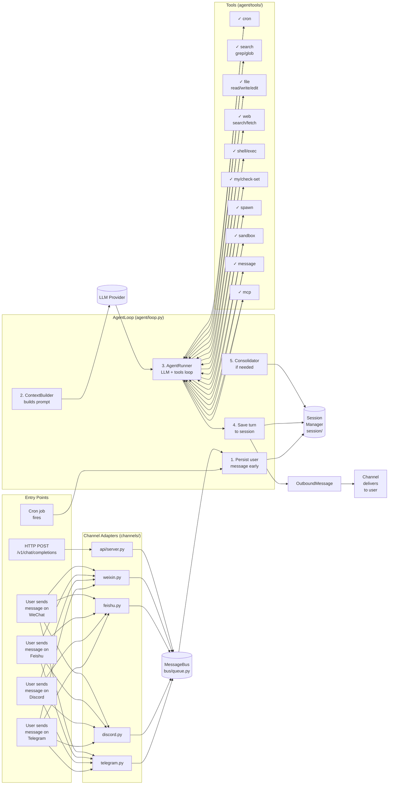
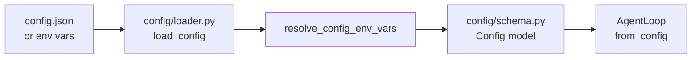
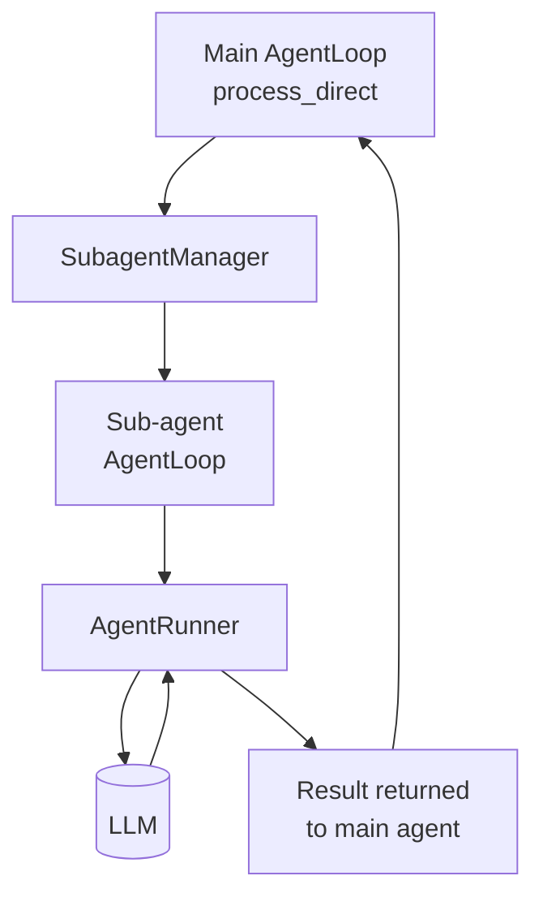

# Data Flow

## Full Turn: Inbound to Outbound



## Channel Adapter Pattern

Every channel adapter follows the same pattern:

```python
# Pseudo-code for all channel adapters
class SomeChannel:
    async def handle_inbound(self, message: dict) -> None:
        """Convert platform-specific message → InboundMessage → bus."""
        inbound = InboundMessage(
            role="user",
            content=message["text"],
            channel="some_channel",
            chat_id=message["chat_id"],
            metadata={...},
        )
        await self.bus.queue.put(inbound)

    async def handle_outbound(self, outbound: OutboundMessage) -> None:
        """Convert OutboundMessage → platform-specific format → send."""
        await self.api.send_text(
            chat_id=outbound.chat_id,
            text=outbound.content,
        )
```

## Session Persistence Flow

```mermaid
sequenceDiagram
    participant U as User
    participant L as AgentLoop
    participant S as SessionManager
    participant FS as JSON Files<br/>(~/.openclaw/sessions/)
    participant MEM as Memory/<br/>Consolidator
    participant LLM as LLM

    Note over U,S: Turn N begins
    U->>L: User message
    L->>S: add_message("user", ...)
    L->>S: save() — persist user before agent runs
    L->>S: _mark_pending_user_turn()

    rect rgb(20, 40, 20)
        Note over L,LLM: Agent runs
        L->>L: _run_agent_loop()
        loop Tool calls
            L->>LLM: chat completions
            LLM-->>L: response
            L->>S: tool calls execute
        end
    end

    L->>S: _save_turn(messages, skip=N)
    L->>S: save() — persist full turn
    S->>FS: write session JSON

    rect rgb(20, 40, 20)
        Note over MEM,LLM: Consolidation check
        MEM->>MEM: maybe_consolidate_by_tokens()
        alt session too large
            MEM->>LLM: summarise(messages)
            LLM-->>MEM: summary
            MEM->>S: store summary
            S->>FS: update session JSON
        else LLM error
            MEM->>MEM: raw_archive(messages)
            S->>FS: raw dump
        end
    end

    Note over U,S: Turn N ends, Turn N+1 begins
```



## Cron Flow

```mermaid
flowchart TD
    CRON_JOB[Cron job fires<br/>at scheduled time]
    CS[CronService]
    CT[CronTool._run_job]
    BUS[(MessageBus)]

    CRON_JOB --> CS
    CS --> CT
    CT --> BUS
    BUS --> LOOP[AgentLoop<br/>process_direct]
    LOOP --> RESULT[Result content]
    RESULT --> DELIVER[Deliver to<br/>channel/chat]

    CT --> CRON_JOB2[Schedule next run<br/>(if recurring)]
```

## Config Flow



## Subagent Flow


