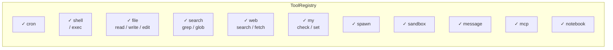

# System Architecture

## Component Map

```mermaid
graph TD
    %% External platforms
    TG[Telegram Bot API]
    DC[Discord WebSocket]
    FX[Feishu API]
    WX[WeChat Work]
    WA[WhatsApp]
    EM[Email IMAP/SMTP]
    WS[WebSocket Clients]
    HTTP[HTTP Clients]

    %% Channels layer
    subgraph channels["channels/"]
        TG_CH[telegram.py]
        DC_CH[discord.py]
        FX_CH[feishu.py]
        WX_CH[weixin.py]
        WA_CH[whatsapp.py]
        EM_CH[email.py]
        WS_CH[websocket.py]
    end

    %% Bus layer
    BUS[(MessageBus<br/>bus/queue.py)]

    %% Agent layer
    subgraph agent["agent/"]
        LOOP[loop.py<br/>process_direct]
        CTX[context.py<br/>ContextBuilder]
        RUNNER[runner.py<br/>AgentRunner]
        MEM[memory.py<br/>Consolidator<br/>Dream]
        HOOK[hook.py<br/>AgentHook]
        TOOLS[tools/<br/>ToolRegistry]
    end

    %% Tools sub-graph
    subgraph tools["agent/tools/"]
        CRON[cron.py]
        SHELL[shell.py]
        SEARCH[search.py<br/>GlobTool<br/>GrepTool]
        FILE[filesystem.py<br/>ReadFile<br/>WriteFile<br/>EditFile]
        WEB[web.py<br/>WebSearch<br/>WebFetch]
        SELF[self.py<br/>MyTool]
        SPAWN[spawn.py]
        SANDBOX[sandbox.py]
        MSG[message.py]
        MCP[mcp.py]
    end

    %% Providers
    subgraph providers["providers/"]
        OPENAI[openai.py]
        ANTHropic[anthropic.py]
        GEMINI[gemini.py]
        AZURE[azure.py]
        GROQ[groq.py]
        OLLAMA[ollama.py]
    end

    %% Bus layer
    BUS2[(MessageBus)]

    %% Session
    SESSION[(SessionManager<br/>session/)]

    %% Cron
    CRON_SVC[(CronService<br/>cron/)]

    %% API
    API[api/server.py<br/>FastAPI]

    %% External LLM
    LLM[LLM Providers<br/>OpenAI / Anthropic / etc.]

    %% Platform → Channels
    TG --> TG_CH
    DC --> DC_CH
    FX --> FX_CH
    WX --> WX_CH
    WA --> WA_CH
    EM --> EM_CH
    WS --> WS_CH

    %% Channels → Bus
    TG_CH --> IN1[inbound]
    DC_CH --> IN2[inbound]
    FX_CH --> IN3[inbound]
    WX_CH --> IN4[inbound]
    WS_CH --> IN5[inbound]
    HTTP --> API
    API --> IN6[inbound]

    IN1 & IN2 & IN3 & IN4 & IN5 & IN6 --> BUS

    %% Bus → Agent
    BUS --> LOOP

    %% Agent internals
    LOOP --> CTX
    LOOP --> RUNNER
    LOOP --> MEM
    LOOP --> HOOK
    LOOP -.-> CRON_SVC
    LOOP --> SESSION

    RUNNER --> TOOLS
    RUNNER --> LLM
    TOOLS --> CRON
    TOOLS --> SHELL
    TOOLS --> SEARCH
    TOOLS --> FILE
    TOOLS --> WEB
    TOOLS --> SELF
    TOOLS --> SPAWN
    TOOLS --> SANDBOX
    TOOLS --> MSG
    TOOLS --> MCP

    LLM --> OPENAI
    LLM --> ANTHropic
    LLM --> GEMINI
    LLM --> AZURE
    LLM --> GROQ
    LLM --> OLLAMA

    %% Agent → Bus (outbound)
    LOOP --> OUT1[outbound]
    OUT1 --> BUS2
    BUS2 --> TG_CH
    BUS2 --> DC_CH
    BUS2 --> FX_CH
    BUS2 --> WX_CH
    BUS2 --> WS_CH

    %% Cron self-trigger
    CRON_SVC --> CRON
    CRON -.-> LOOP

    %% Session persistence
    SESSION -.-> SESSION

    style BUS fill:#1a1a2e,color:#fff,stroke:#00b4d8
    style BUS2 fill:#1a1a2e,color:#fff,stroke:#00b4d8
    style LLM fill:#16213e,color:#fff,stroke:#e94560
    style LOOP fill:#0f3460,color:#fff,stroke:#00b4d8
    style RUNNER fill:#0f3460,color:#fff,stroke:#00b4d8
    style CTX fill:#0f3460,color:#fff,stroke:#00b4d8
    style MEM fill:#0f3460,color:#fff,stroke:#00b4d8
    style HOOK fill:#0f3460,color:#fff,stroke:#00b4d8
    style TOOLS fill:#16213e,color:#fff,stroke:#00b4d8
    style CRON_SVC fill:#16213e,color:#fff,stroke:#00b4d8
    style SESSION fill:#16213e,color:#fff,stroke:#00b4d8
    style API fill:#16213e,color:#fff,stroke:#00b4d8
```



## Agent Internal Flow

```mermaid
sequenceDiagram
    participant CH as Channel<br/>(e.g. telegram)
    participant BUS as MessageBus
    participant LOOP as AgentLoop
    participant CTX as ContextBuilder
    participant RUNNER as AgentRunner
    participant LLM as LLM Provider
    participant TOOLS as ToolRegistry
    participant MEM as Consolidator
    participant SESSION as SessionManager
    participant CRON as CronService

    CH->>BUS: queue.put(InboundMessage)
    BUS->>LOOP: process_direct(message)

    rect rgb(20, 30, 50)
        Note over LOOP: Pre-processing
        LOOP->>SESSION: save runtime checkpoint
        LOOP->>LOOP: persist user message early
        LOOP->>SESSION: sessions.save()
    end

    LOOP->>CTX: build(initial_messages)
    CTX->>SESSION: load session history

    rect rgb(20, 30, 50)
        Note over LOOP: Agent Loop (Runner)
        LOOP->>RUNNER: run(initial_messages)
        RUNNER->>LLM: chat completions
        LLM-->>RUNNER: response (tool_calls or content)
        RUNNER->>TOOLS: dispatch tool calls
        TOOLS-->>RUNNER: tool results
        RUNNER->>LLM: continue with results
        Note over RUNNER: loops until no more tool calls
    end

    RUNNER-->>LOOP: final_content, messages, stop_reason

    rect rgb(20, 30, 50)
        Note over LOOP: Post-processing
        LOOP->>MEM: maybe_consolidate_by_tokens()
        LOOP->>SESSION: _save_turn()
        LOOP->>SESSION: sessions.save()
        LOOP->>CRON: schedule consolidation
    end

    LOOP->>BUS: queue.put(OutboundMessage)
    BUS->>CH: deliver to user

    CRON-->>LOOP: trigger (async callback)
    LOOP->>LOOP: process_direct(cron_context)
```

## Tool Registry



## Key Design Decisions

### 1. Unified session key
All channels share a single `UNIFIED_SESSION_KEY = "unified:default"` by default. Each channel message is tagged with its `chat_id` for multi-user isolation, but the session history is merged across channels.

### 2. Bus as central hub
All channel adapters publish to a single `MessageBus`. This decouples channels from the agent — channels only know about the bus, not the agent directly.

### 3. Tools as first-class citizens
Tools are registered in a `ToolRegistry` and dispatched dynamically. The agent decides at runtime which tools to call, not the developer.

### 4. Crash-safe turns
User messages are persisted to the session **before** the agent loop runs. If the process crashes mid-turn, the session log contains enough to recover — no user prompt is silently lost.

### 5. Consolidation over truncation
When session history grows large, nanobot summarises with an LLM call rather than truncating. This preserves context while staying within token limits. On LLM failure, raw messages are archived without loss.
