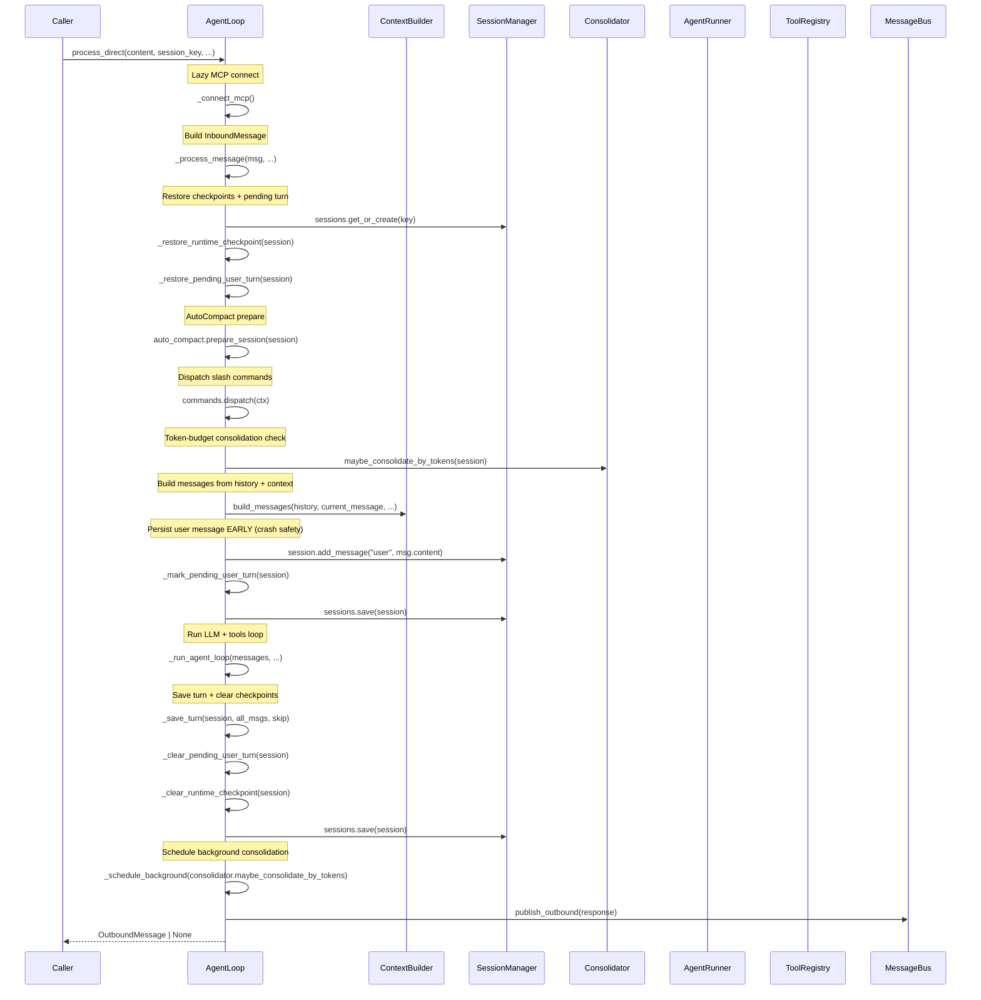
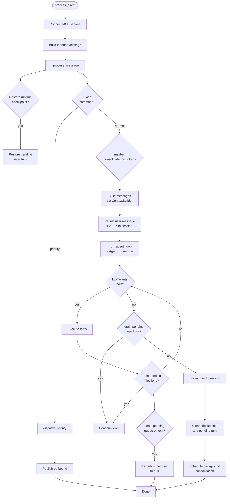

# `agent/loop.py` — AgentLoop

The `AgentLoop` is the core processing engine. It receives messages from the bus, orchestrates the full turn, and sends responses back.

## Entry Points

### `process_direct()`

Main entry for external callers. Takes a plain content string and orchestrates the full turn.

```python
async def process_direct(
    self,
    content: str,
    session_key: str = "cli:direct",
    channel: str = "cli",
    chat_id: str = "direct",
    media: list[str] | None = None,
    on_progress: Callable[[str], Awaitable[None]] | None = None,
    on_stream: Callable[[str], Awaitable[None]] | None = None,
    on_stream_end: Callable[..., Awaitable[None]] | None = None,
) -> OutboundMessage | None:
```

**Flow:**

1. `await self._connect_mcp()` — lazy-connect to MCP servers
2. Wrap content in `InboundMessage`, call `self._process_message(...)`
3. Return the resulting `OutboundMessage`

---

## Sequence Diagram: `process_direct`



---

## `_run_agent_loop()`

Runs the LLM + tools iteration until done or max iterations reached.

```python
async def _run_agent_loop(
    self,
    initial_messages: list[dict],
    on_progress=None,
    on_stream=None,
    on_stream_end=None,
    *,
    session: Session | None = None,
    channel: str = "cli",
    chat_id: str = "direct",
    message_id: str | None = None,
    pending_queue: asyncio.Queue | None = None,
) -> tuple[str | None, list[str], list[dict], str, bool]:
```

Returns: `(final_content, tools_used, messages, stop_reason, had_injections)`

Delegates to `AgentRunner.run(AgentRunSpec(...))`.

---

## `_save_turn()`

Persists a completed turn into the session's message history.

```python
def _save_turn(self, session: Session, messages: list[dict], skip: int) -> None:
```

- Iterates `messages[skip:]` (skip the already-persisted user message)
- For `tool` role: truncates results > `max_tool_result_chars` via `_sanitize_persisted_blocks()`
- For `user` role: strips runtime context blocks, filters multimodal payloads
- Skips empty assistant messages (they poison session context)
- Updates `session.updated_at`

---

## `maybe_consolidate_by_tokens()`

Triggered after each turn and scheduled as background task. Delegates to `Consolidator`:

```python
async def maybe_consolidate_by_tokens(self, session: Session) -> None:
    self._schedule_background(self.consolidator.maybe_consolidate_by_tokens(session))
```

---

## User Message Early Persistence (Crash Safety)

Before calling `_run_agent_loop`, the triggering user message is persisted immediately:

```python
user_persisted_early = False
if isinstance(msg.content, str) and msg.content.strip():
    session.add_message("user", msg.content)
    self._mark_pending_user_turn(session)  # metadata flag
    self.sessions.save(session)
    user_persisted_early = True
```

**Why?** If the process is killed mid-turn (OOM, SIGKILL, self-restart), the runtime checkpoint preserves the in-flight assistant/tool state but **not** the user message itself. Saving upfront ensures recovery from the session log alone.

On recovery: `_restore_pending_user_turn()` closes the turn with an error message.

---

## Unified Session Key

The session key determines task routing and mid-turn injection:

```python
UNIFIED_SESSION_KEY = "unified:default"

def _effective_session_key(self, msg: InboundMessage) -> str:
    if self._unified_session and not msg.session_key_override:
        return UNIFIED_SESSION_KEY
    return msg.session_key
```

When `unified_session=True`, all messages route to a single session key regardless of origin. Follow-up messages for a session with an active task are **routed to a pending queue** (max size 20) for mid-turn injection, rather than spawning a competing task.

---

## Flowchart: Loop Iterations



---

## Key Design Points

| Aspect | Detail |
|--------|--------|
| **Crash safety** | User message persisted before `_run_agent_loop`; runtime checkpoint saved after each tool call |
| **Mid-turn injection** | Follow-up messages for active sessions queue into `pending_queue` (up to 3 per turn, max 5 cycles) |
| **Unified session** | `unified:default` key collapses all sessions when `unified_session=True` |
| **Concurrency** | Per-session lock + optional global semaphore (`NANOBOT_MAX_CONCURRENT_REQUESTS`) |
| **Streaming** | Split into distinct stream segments (`stream_base_id:segment`) with `resuming` flag for tool call follow-up |
| **Checkpoint key** | `_RUNTIME_CHECKPOINT_KEY` in session metadata preserves in-flight assistant + tool state |
| **Pending turn key** | `_PENDING_USER_TURN_KEY` flags sessions that only persisted user message (crash before assistant) |