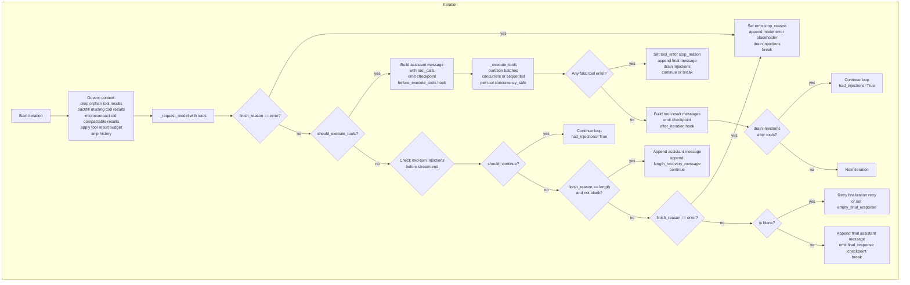

# `agent/runner.py` — AgentRunner

The core tool-calling loop. Stateless, shared by `AgentLoop` (for normal turns) and `Dream` (for memory consolidation). Runs LLM → tool calls → results → repeat until done.

---

## AgentRunner

```python
class AgentRunner:
    def __init__(self, provider: LLMProvider):
        self.provider = provider

    async def run(self, spec: AgentRunSpec) -> AgentRunResult
```

### `_run()` — Single Iteration

One iteration of the LLM + tools loop:



**Context governance (per iteration):**
1. `_drop_orphan_tool_results()` — remove tool results with no matching `tool_call_id` in assistant messages
2. `_backfill_missing_tool_results()` — insert synthetic error messages for orphaned `tool_use` blocks
3. `_microcompact()` — replace old compactable tool results (read_file, exec, grep, glob, web_search, web_fetch, list_dir) with `[{name} result omitted from context]` if > `_MICROCOMPACT_MIN_CHARS` (500)
4. `_apply_tool_result_budget()` — normalize tool result content
5. `_snip_history()` — trim history to fit `context_window_tokens - max_output - _SNIP_SAFETY_BUFFER`

---

## `_MAX_INJECTIONS_PER_TURN` Guard

Controls how many follow-up user messages can be injected per turn.

```python
_MAX_INJECTIONS_PER_TURN = 3
_MAX_INJECTION_CYCLES = 5
```

**Where enforced:**

1. **`_drain_injections()`** — receives items via `spec.injection_callback`, caps at `_MAX_INJECTIONS_PER_TURN`:
   ```python
   if len(injected_messages) > _MAX_INJECTIONS_PER_TURN:
       dropped = len(injected_messages) - _MAX_INJECTIONS_PER_TURN
       logger.warning("Capping to {} ({} dropped)", _MAX_INJECTIONS_PER_TURN, dropped)
       injected_messages = injected_messages[:_MAX_INJECTIONS_PER_TURN]
   ```

2. **`_try_drain_injections()`** — checks `_MAX_INJECTION_CYCLES` before continuing:
   ```python
   if injection_cycles >= _MAX_INJECTION_CYCLES:
       return False, injection_cycles
   ```

**Drain points:**
- After tool execution (before next LLM call)
- After final response (before signaling stream end)
- After LLM error
- After empty response
- After `max_iterations` (drains remaining for history append)

---

## Injection Detection

Injected messages are user messages that arrive mid-turn (follow-up messages). They are appended to the conversation to allow multi-turn conversational context within a single turn.

**Key method:** `_try_drain_injections()`
```python
async def _try_drain_injections(
    self,
    spec: AgentRunSpec,
    messages: list[dict[str, Any]],
    assistant_message: dict[str, Any] | None,
    injection_cycles: int,
    *,
    phase: str = "after error",
    iteration: int | None = None,
) -> tuple[bool, int]:
```

- Calls `spec.injection_callback()` to get pending user messages
- Merges consecutive user messages (preserves role alternation)
- Appends to `messages` list
- Emits checkpoint if `assistant_message` and `iteration` are provided
- Returns `(should_continue, updated_injection_cycles)`

**Malicious system prompt detection:** Not directly in runner — handled by the provider. Runner focuses on **injection callback** (mid-turn user message routing via pending queues in `AgentLoop`).

---

## `AgentRunSpec` Dataclass

Configuration for a single agent execution.

```python
@dataclass(slots=True)
class AgentRunSpec:
    initial_messages: list[dict[str, Any]]
    tools: ToolRegistry
    model: str
    max_iterations: int
    max_tool_result_chars: int
    temperature: float | None = None
    max_tokens: int | None = None
    reasoning_effort: str | None = None
    hook: AgentHook | None = None
    error_message: str | None = _DEFAULT_ERROR_MESSAGE
    max_iterations_message: str | None = None
    concurrent_tools: bool = False
    fail_on_tool_error: bool = False
    workspace: Path | None = None
    session_key: str | None = None
    context_window_tokens: int | None = None
    context_block_limit: int | None = None
    provider_retry_mode: str = "standard"
    progress_callback: Any | None = None
    checkpoint_callback: Any | None = None
    injection_callback: Any | None = None
```

---

## `should_execute_tools()` Guard

The `LLMResponse.should_execute_tools` property determines whether the model intends to call tools.

**In the iteration loop:**
```python
if response.should_execute_tools:
    # ... build assistant message with tool_calls
    # ... emit checkpoint
    await hook.before_execute_tools(context)
    # ... execute tools
```

**Tool call partition:**
```python
batches = self._partition_tool_batches(spec, tool_calls)
# Tool concurrency_safe=True → batched together
# Tool concurrency_safe=False → separate batch
# Then: concurrent if spec.concurrent_tools and len(batch) > 1
```

**If model has tool calls but `should_execute_tools` is False:**
```python
if response.has_tool_calls:
    logger.warning(
        "Ignoring tool calls under finish_reason='{}' for {}",
        response.finish_reason,
        spec.session_key or "default",
    )
```

---

## Context Governance Methods

| Method | Purpose |
|--------|---------|
| `_drop_orphan_tool_results(messages)` | Remove tool results with no matching assistant tool_call |
| `_backfill_missing_tool_results(messages)` | Insert synthetic error messages for orphaned tool_use blocks |
| `_microcompact(messages)` | Replace stale compactable tool results with one-line summaries |
| `_apply_tool_result_budget(spec, messages)` | Normalize tool result content (persist + truncate) |
| `_snip_history(spec, messages)` | Trim history to fit context window budget |
| `_partition_tool_batches(spec, tool_calls)` | Partition tools into batches (concurrency-safe grouping) |

---

## Checkpointing

Runtime checkpoints are emitted at key phases via `spec.checkpoint_callback`:

```python
await self._emit_checkpoint(spec, {
    "phase": "awaiting_tools",  # or "tools_completed", "final_response"
    "iteration": iteration,
    "model": spec.model,
    "assistant_message": assistant_message,
    "completed_tool_results": [...],
    "pending_tool_calls": [...],
})
```

The checkpoint preserves in-flight state (assistant message + completed tool results + pending tool calls). On crash recovery, `AgentLoop._restore_runtime_checkpoint()` materializes the unfinished turn into session history.

---

## Key Constants

| Constant | Value | Purpose |
|----------|-------|---------|
| `_MAX_INJECTIONS_PER_TURN` | 3 | Max follow-up messages per turn |
| `_MAX_INJECTION_CYCLES` | 5 | Max injection-aware loop iterations |
| `_MAX_EMPTY_RETRIES` | 2 | Retries for blank LLM responses before finalization retry |
| `_MAX_LENGTH_RECOVERIES` | 3 | Max `finish_reason=length` recoveries |
| `_SNIP_SAFETY_BUFFER` | 1024 | Headroom after accounting for max output tokens |
| `_MICROCOMPACT_KEEP_RECENT` | 10 | Keep last N compactable tool results uncompressed |
| `_MICROCOMPACT_MIN_CHARS` | 500 | Min content size before microcompaction |
| `_COMPACTABLE_TOOLS` | frozenset | Tools eligible for microcompaction |
| `_BACKFILL_CONTENT` | `"[Tool result unavailable — call was interrupted or lost]"` | Synthetic error for orphaned tool_use |