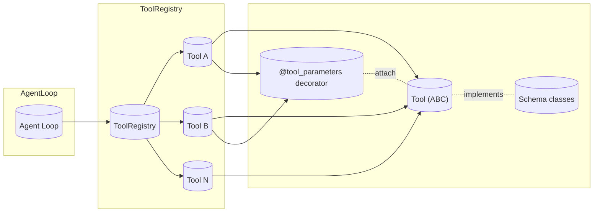
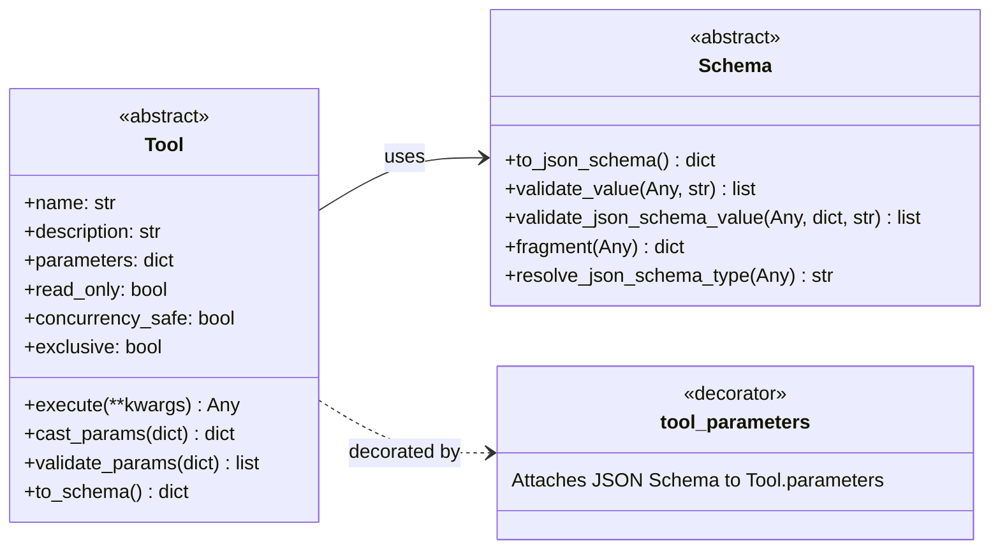
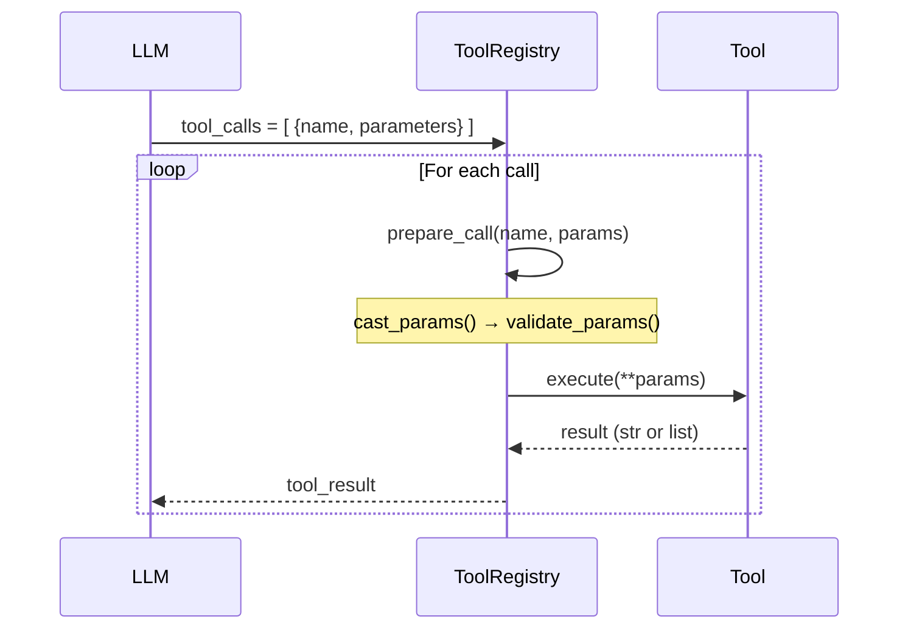
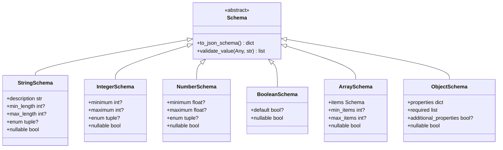
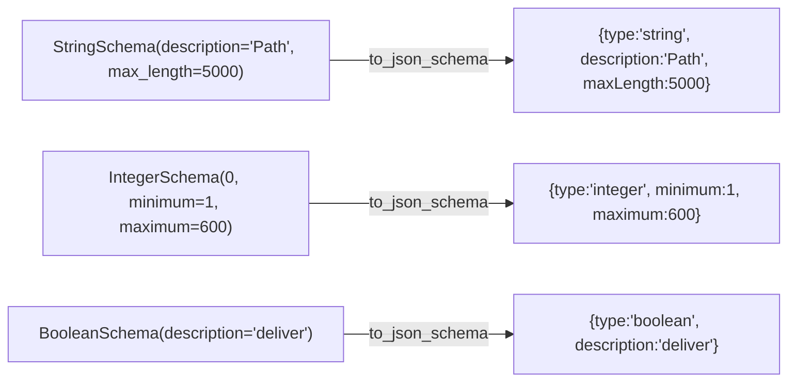
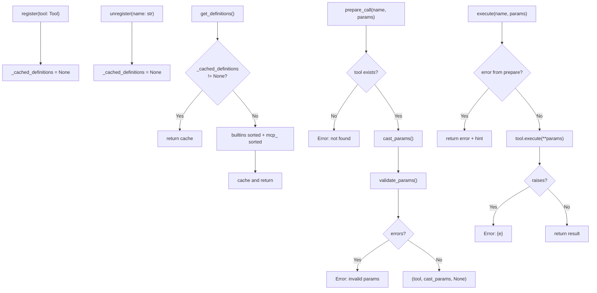

# Tools Overview

The nanobot agent is extended through a **plugin-style tool system** built on JSON Schema validation, a central registry, and an async execution model.

---

## Architecture

- **`Tool`** (ABC) — every tool inherits from this and implements `name`, `description`, `parameters`, and `execute()`.
- **`@tool_parameters`** — class decorator that attaches a JSON Schema to `parameters` without boilerplate.
- **`Schema`** — abstract base for typed schema fragments (`StringSchema`, `IntegerSchema`, etc.).
- **`ToolRegistry`** — single source of truth: registers tools, dispatches calls, validates, and caches definitions.

---

## Tool Base Class

### Tool Lifecycle in the Agent Loop

---

## Schema System

All schema types subclass `Schema` and implement `to_json_schema()`.

### Schema → JSON Schema Fragment

---

## Built-in Tools

| Tool Name | File | Purpose |
|-----------|------|---------|
| `my` | `self.py` | Inspect and mutate the agent loop's runtime state (scratchpad, config, iteration) |
| `cron` | `cron.py` | Schedule one-time or recurring tasks with cron expressions or intervals |
| `exec` | `shell.py` | Execute shell commands with sandboxing, timeout, and env filtering |
| `web_search` | `web.py` | Search the web via Brave, DuckDuckGo, Tavily, SearXNG, Jina, or Kagi |
| `web_fetch` | `web.py` | Fetch a URL and extract readable content (markdown/text) |
| `grep` | `search.py` | Search file contents with regex, context lines, and glob filters |
| `glob` | `search.py` | Find files by glob patterns (py, md, json, etc.) |
| `read_file` | `filesystem.py` | Read file contents with optional offset/limit |
| `write_file` | `filesystem.py` | Write content to a file (creates or overwrites) |
| `edit_file` | `filesystem.py` | Apply targeted text replacements to a file |
| `list_dir` | `filesystem.py` | List directory contents |
| `make_dir` | `filesystem.py` | Create a directory |
| `remove_path` | `filesystem.py` | Remove a file or directory (recoverable via trash) |
| `move_path` | `filesystem.py` | Move/rename a file or directory |
| `copy_path` | `filesystem.py` | Copy a file |
| `path_info` | `filesystem.py` | Get file metadata (size, mtime, is_dir) |
| `spawn` | `spawn.py` | Spawn a sub-agent session |
| `message` | `message.py` | Send messages to external channels (Telegram, WeChat, Discord, etc.) |
| `file_state` | `file_state.py` | Track and persist per-file operation state across turns |
| `notebook` | `notebook.py` | Execute cells in a Jupyter-style notebook |
| `mcp_*` | `mcp.py` | MCP server tools (dynamic, prefixed with `mcp_`) |

---

## ToolRegistry Flow

