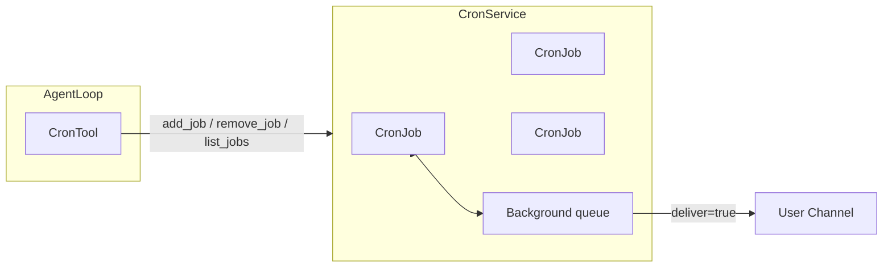
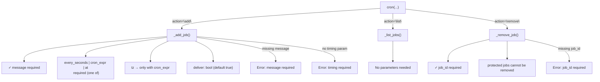
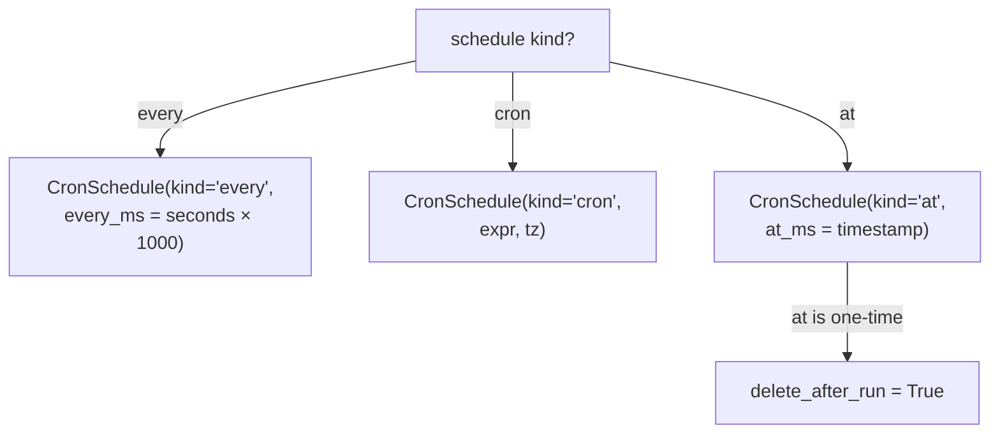
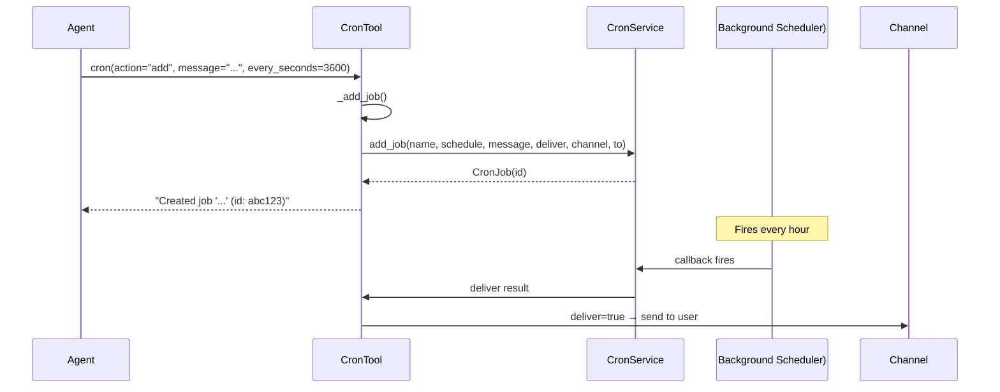
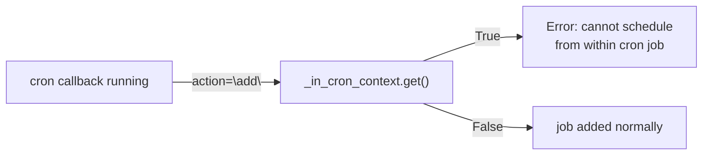
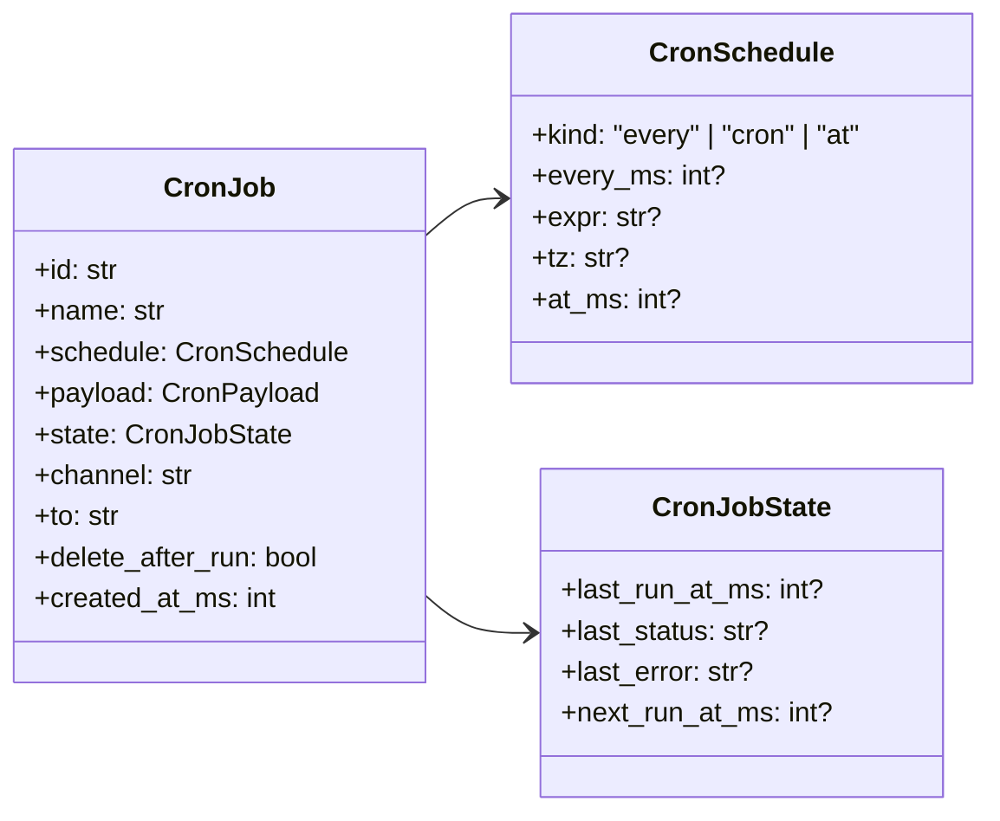

# CronTool — Scheduling Reminders & Recurring Tasks

**File:** `tools/cron.py`
**Tool name:** `cron`

Schedules background jobs that fire based on intervals, cron expressions, or one-time timestamps. Backed by `CronService`. Results can be delivered to the user's channel automatically.

---

## Architecture



---

## Per-Action Schema



### Parameter Requirements by Action

| Parameter | `add` | `list` | `remove` |
|-----------|:-----:|:------:|:--------:|
| `action` | ✅ Required | ✅ Required | ✅ Required |
| `message` | ✅ **Required** | Not used | Not used |
| `job_id` | Not used | Not used | ✅ **Required** |
| `name` | Optional | Not used | Not used |
| `every_seconds` | Optional | Not used | Not used |
| `cron_expr` | Optional | Not used | Not used |
| `tz` | Optional (with cron_expr) | Not used | Not used |
| `at` | Optional | Not used | Not used |
| `deliver` | Optional | Not used | Not used |

---

## Scheduling Modes



### Timing String Formatting

| Kind | Example Output |
|------|---------------|
| `every` (hours) | `"every 24h"` |
| `every` (minutes) | `"every 60m"` |
| `every` (seconds) | `"every 30s"` |
| `every` (ms) | `"every 500ms"` |
| `cron` | `"cron: 0 9 * * * (Asia/Singapore)"` |
| `at` | `"at 2026-06-01T09:00:00+08:00 (Asia/Singapore)"` |

---

## CronService Integration



---

## `deliver` Flag

```mermaid
flowchart LR
    F["cron(action=\"add\", deliver=?)"]
    F -->|deliver=true| D1["Result sent to user channel"]
    F -->|deliver=false| D2["Silent background execution\n no user notification"]
```

- **`deliver=true` (default):** When the job fires, the result is delivered to the session's channel/chat_id.
- **`deliver=false`:** The job runs silently. Useful for background maintenance tasks that don't need user-facing output.

The session `channel` and `chat_id` are captured via `set_context()` when the tool is called during an active session and restored in cron callbacks for delivery.

---

## Context Guard



A `ContextVar` (`_in_cron_context`) tracks whether execution is happening inside a cron callback. Jobs cannot create child jobs to prevent infinite recursion.

---

## Error Handling

| Situation | Response |
|----------|---------|
| `action="add"` without `message` | `"Error: cron action='add' requires a non-empty 'message'..."` |
| `action="add"` with no timing param | `"Error: either every_seconds, cron_expr, or at is required"` |
| `tz` without `cron_expr` | `"Error: tz can only be used with cron_expr"` |
| Invalid timezone | `"Error: unknown timezone 'Foo'"` |
| Invalid ISO datetime for `at` | `"Error: invalid ISO datetime format '...'` |
| `action="remove"` without `job_id` | `"Error: job_id is required for remove"` |
| Remove protected system job | `"Cannot remove job 'dream'. This is a system-managed..."` |
| Remove non-existent job | `"Job abc123 not found"` |
| Cron callback tries to add job | `"Error: cannot schedule new jobs from within a cron job execution"` |

---

## CronJob Structure



---

## System Jobs

| Job Name | Purpose | Removable |
|----------|---------|:---------:|
| `dream` | Dream memory consolidation for long-term memory | ❌ No (protected) |

System jobs show `Purpose: Dream memory consolidation...` in list output and return `"Protected: visible for inspection, but cannot be removed."` on remove attempt.

---

## Usage Examples

```python
# Recurring every hour
cron(action="add", message="Check disk space and report if > 80%", every_seconds=3600)
# → Created job 'Check disk space...' (id: abc123)

# Daily cron at 9 AM SGT
cron(action="add", message="Daily standup reminder",
     cron_expr="0 9 * * *", tz="Asia/Singapore")
# → Created job 'Daily standup reminder' (id: def456)

# One-time reminder
cron(action="add", message="Team meeting in 5 minutes",
     at="2026-04-20T10:25:00")
# → Created job 'Team meeting in 5...' (id: ghi789)

# Silent background task
cron(action="add", message="Sync logs to backup", every_seconds=86400, deliver=false)
# → Created job 'Sync logs to backup' (id: jkl012)

# List all jobs
cron(action="list")
# → Scheduled jobs:
#   - Daily standup reminder (id: def456, cron: 0 9 * * * (Asia/Singapore))
#     Next run: 2026-04-21T09:00:00+08:00 (Asia/Singapore)
#   - Check disk space... (id: abc123, every 1h)
#     Next run: 2026-04-20T11:00:00 (UTC)

# Remove a job
cron(action="remove", job_id="abc123")
# → Removed job abc123
```
