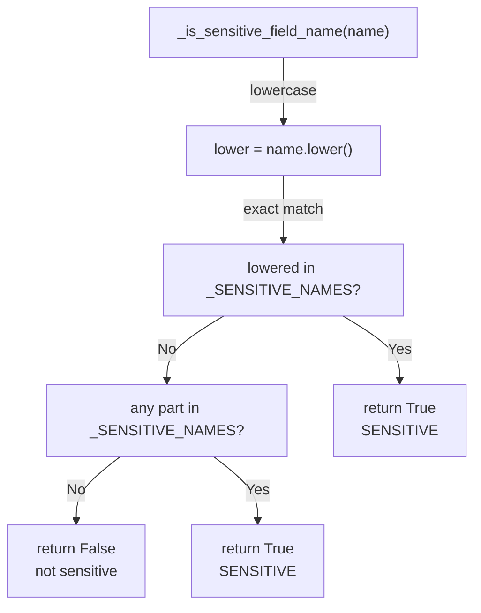
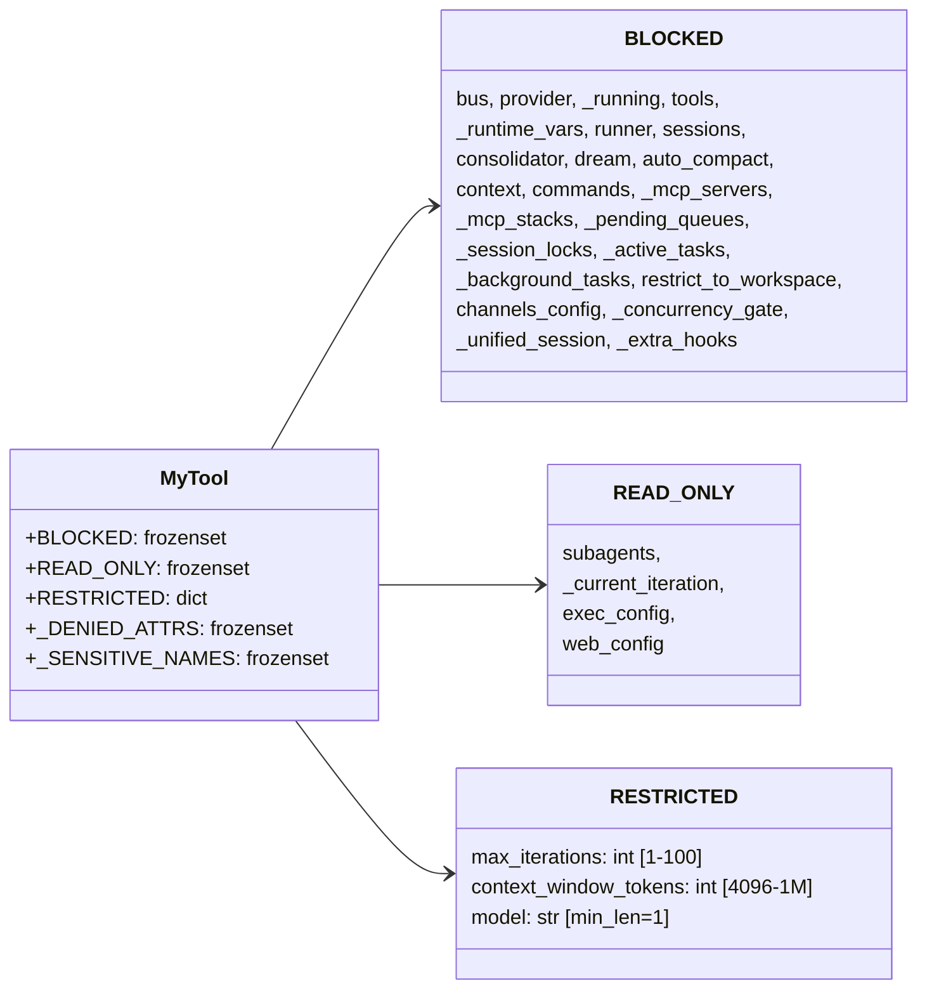
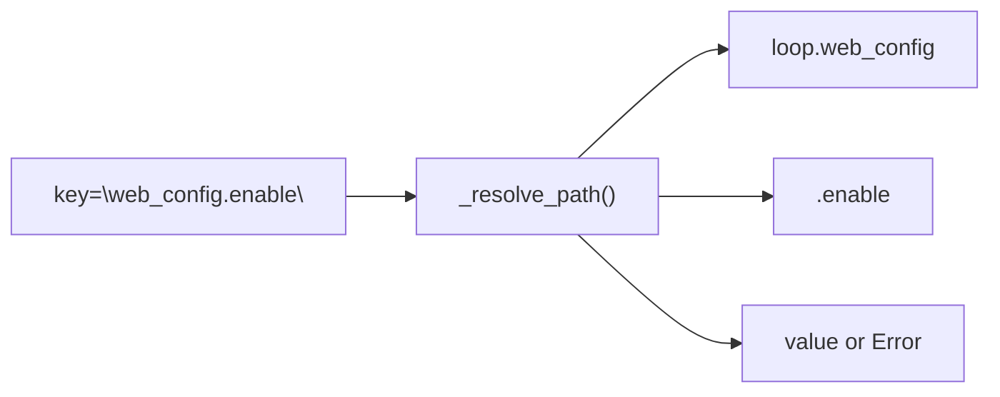
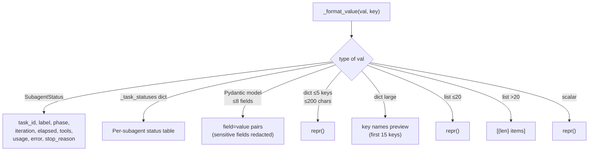

# MyTool — Runtime State Inspection & Configuration

**File:** `tools/self.py`
**Tool name:** `my`

Allows the agent to introspect and modify its own runtime environment — configuration values, scratchpad storage, subagent status, and iteration state — without external channels.

---

## Actions

```mermaid
flowchart LR
    A["my(action=\"check\")"] --> B["_inspect(key?)"]
    A2["my(action=\"set\")"] --> C["_modify(key, value)"]

    B --> B1{"key\nprovided?"}
    B1 -->|No| B2["_inspect_all()\n(all RESTRICTED + useful keys)"]
    B1 -->|Yes| B3["_resolve_path()\n dot-path traversal"]
    B3 --> B4["_format_value()\n smart formatter"]

    C --> C1{"key\nin BLOCKED?"}
    C1 -->|Yes| C2["Error: protected"]
    C1 -->|No| C3{"key\nin READ_ONLY?"}
    C3 -->|Yes| C4["Error: read-only"]
    C3 -->|No| C5{"key\nin RESTRICTED?"}
    C5 -->|Yes| C6["_modify_restricted()\n type/bounds check"]
    C5 -->|No| C7["_modify_free()\n free-form set"]
```

---

## Sensitive Field Protection



The `_is_sensitive_field_name()` method blocks any field whose name (or any underscore-separated component) matches:

| Category | Blocked Names |
|----------|--------------|
| Credentials | `api_key`, `secret`, `password`, `token`, `credential` |
| Auth tokens | `access_token`, `refresh_token`, `auth` |
| Keys | `private_key` |

---

## Parameter Classification



### BLOCKED — Cannot Inspect or Modify

These fields are fully protected at both the top level and any dot-path leaf:

- Core infrastructure: `bus`, `provider`, `_running`, `tools`
- Config management: `_runtime_vars`
- Subsystems: `runner`, `sessions`, `consolidator`, `dream`, `auto_compact`, `context`, `commands`
- Sensitive runtime: `_mcp_servers`, `_mcp_stacks`, `_pending_queues`, `_session_locks`, `_active_tasks`, `_background_tasks`
- Security boundaries: `restrict_to_workspace`, `channels_config`, `_concurrency_gate`, `_unified_session`, `_extra_hooks`

### READ_ONLY — Inspect OK, Modify BLOCKED

| Parameter | Type | Description |
|-----------|------|-------------|
| `subagents` | object | Subagent manager — observable but replacing breaks the system |
| `_current_iteration` | int | Updated by runner only |
| `exec_config` | object | Inspect allowed (e.g. check sandbox), modify blocked |
| `web_config` | object | Inspect allowed (e.g. check enable), modify blocked |

### RESTRICTED — Modify with Type/Bounds Checking

| Parameter | Type | Constraints |
|-----------|------|-------------|
| `max_iterations` | `int` | 1 ≤ value ≤ 100 |
| `context_window_tokens` | `int` | 4096 ≤ value ≤ 1,000,000 |
| `model` | `str` | min length 1 |

### SETTABLE via RESTRICTED Modify

```python
my(action="set", key="max_iterations", value=50)
my(action="set", key="context_window_tokens", value=32000)
my(action="set", key="model", value="claude-sonnet-4-20250514")
```

### SETTABLE via Free Modify (stored in `_runtime_vars` scratchpad)

Any scalar value (`str`, `int`, `float`, `bool`) or JSON-safe container (`dict`, `list`) not already a real `AgentLoop` attribute is stored in the scratchpad:

```python
my(action="set", key="user_preference", value="prefer-short-answers")
my(action="set", key="my_notes", value=["todo: review PR", "done: deployed"])
```

---

## Dot-Path Navigation



Supported for both `check` and `set`:
- `_last_usage.prompt_tokens` — token usage stats
- `web_config.enable` — web config sub-field
- `exec_config.sandbox` — exec config sub-field

---

## Smart Value Formatting



---

## Usage Examples

```python
# Full config overview
my(action="check")
# → max_iterations: 100
#   context_window_tokens: 200000
#   model: 'claude-sonnet-4-20250514'
#   workspace: '/home/user/nanobot'
#   ...

# Inspect a specific key
my(action="check", key="max_iterations")
# → max_iterations: 100

# Inspect nested value
my(action="check", key="_last_usage.prompt_tokens")
# → _last_usage.prompt_tokens: 18420

# Inspect subagent status
my(action="check", key="subagents")
# → subagents: 2 registered — ['GHIssuesTool', 'CodeReviewTool']

# Store a session preference (scratchpad)
my(action="set", key="user_preference", value="verbose")
# → Set scratchpad.user_preference = 'verbose' (was None)

# Set a RESTRICTED value
my(action="set", key="max_iterations", value=50)
# → Set max_iterations = 50 (was 100)

# Modify a dot-path sub-field
my(action="set", key="web_config.enable", value=true)
# → Set web_config.enable = True
```

### Error Cases

```python
# BLOCKED key
my(action="set", key="bus", value="x")
# → Error: 'bus' is protected and cannot be modified

# READ_ONLY key
my(action="set", key="subagents", value="x")
# → Error: 'subagents' is read-only and cannot be modified

# RESTRICTED out of bounds
my(action="set", key="max_iterations", value=999)
# → Error: 'max_iterations' must be <= 100

# Callable rejection
my(action="set", key="fn", value=lambda: 1)
# → Error: cannot store callable values
```
