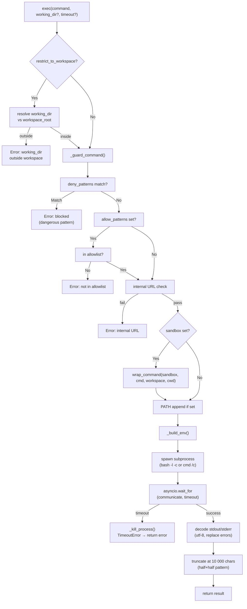
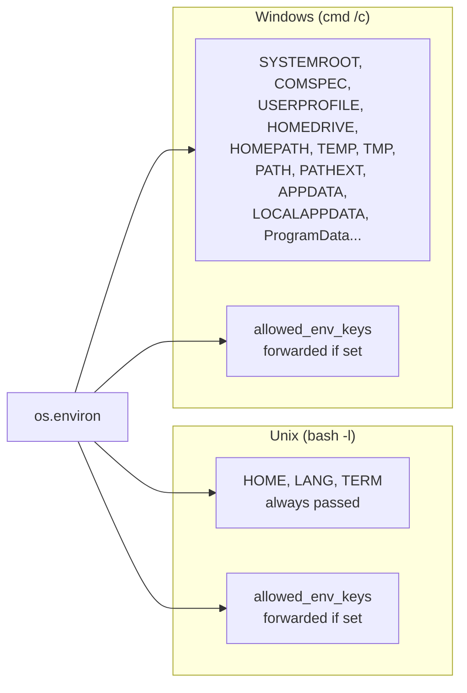
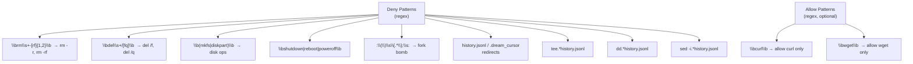
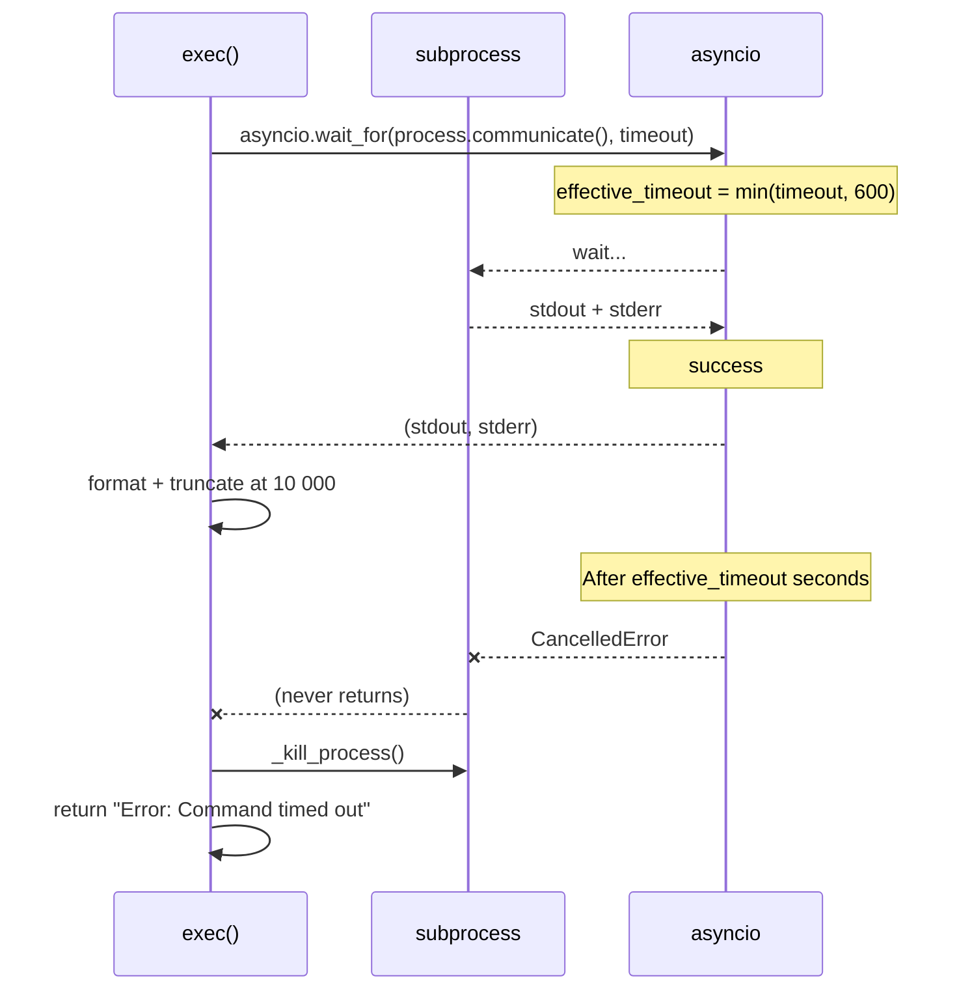

# ExecTool — Shell Command Execution

**File:** `tools/shell.py`
**Tool name:** `exec`

Executes arbitrary shell commands in a subprocess with timeout enforcement, environment variable filtering, optional sandboxing, and workspace restriction.

---

## Execution Flow



---

## Environment Variable Filtering



### `allowed_env_keys`

```python
# Only these keys from os.environ are forwarded to the subprocess
allowed_env_keys: list[str] = ["OPENAI_API_KEY", "BRAVE_API_KEY", "MY_CUSTOM_VAR"]
```

- On **Unix**: Only `HOME`, `LANG`, `TERM` are unconditionally forwarded. Login shell (`bash -l`) populates `PATH` and other essentials via profile. Additional keys from `allowed_env_keys` are merged in.
- On **Windows**: A curated set of system variables is forwarded unconditionally. Additional keys from `allowed_env_keys` are merged in.
- **All secrets** (API keys, tokens, passwords) are **never forwarded** unless explicitly named in `allowed_env_keys`.

---

## Sandbox Integration

```mermaid
flowchart LR
    SB["sandbox = \"bwrap\" | \"proot\" | \"nspawn\"..."]
    SB --> W["wrap_command(sandbox, command, workspace, cwd)"]
    W -->|"bwrap"| B["bwrap --dev --proc /proc \\\n  --bind workspace / \\\n  --tmpfs /tmp \\\n  command"]
    W -->|"proot"| P["proot -r workspace \\\n  -b /proc \\\n  command"]
    W -->|"nspawn"| N["systemd-nspawn --register=no \\\n  --bind =/proc \\\n  -D workspace \\\n  command"]
```

Sandboxing is only applied on **Unix**. On Windows, a warning is logged and the command runs unsandboxed.

---

## Safety Guards



### Path Restriction (`restrict_to_workspace`)

When enabled, any absolute path in the command is checked:
- Must be under `cwd` or the configured `workspace_root`
- Or under the media directory (`get_media_dir()`)
- `..` traversal patterns are blocked

---

## Timeout Handling



- **Default timeout:** 60 seconds
- **Maximum timeout:** 600 seconds
- Timeout is capped at `min(timeout, _MAX_TIMEOUT)` even if a larger value is passed.
- On timeout: process is killed via `_kill_process()` (SIGKILL + zombie reaping).

---

## Parameter Summary

| Parameter | Type | Default | Description |
|-----------|------|---------|-------------|
| `command` | `str` | — | Shell command to execute |
| `working_dir` | `str?` | configured `working_dir` | Working directory |
| `timeout` | `int` | 60 | Timeout in seconds (max 600) |

---

## Constructor Options

| Option | Type | Default | Description |
|--------|------|---------|-------------|
| `timeout` | `int` | 60 | Default timeout for all commands |
| `working_dir` | `str?` | `None` | Default working directory |
| `deny_patterns` | `list[str]` | [default blocklist] | Regex patterns to block |
| `allow_patterns` | `list[str]` | `[]` | If set, only these patterns are allowed |
| `restrict_to_workspace` | `bool` | `False` | Block access outside workspace |
| `sandbox` | `str` | `""` | Sandbox backend (`bwrap`, `proot`, etc.) |
| `path_append` | `str` | `""` | Append to `PATH` |
| `allowed_env_keys` | `list[str]` | `[]` | Env vars to forward |

---

## Output Formatting

```
STDOUT:
<output>

STDERR:
<stderr_text>

Exit code: <code>
```

- `stderr` is only included if it has non-whitespace content
- Output truncated at **10 000 characters** using a **head+tail** split pattern to show beginning and end

---

## Security Summary

| Concern | Protection |
|---------|-----------|
| Destructive commands | Regex deny patterns (`rm -rf`, `del /f`, etc.) |
| History corruption | Blocks redirects to `history.jsonl` / `.dream_cursor` |
| Credential exfil | Env keys not forwarded to subprocess |
| Internal URL SSRF | `contains_internal_url()` check |
| Path traversal | `..` pattern detection + workspace anchoring |
| External path access | Paths checked against `cwd`/`workspace_root`/`media_dir` |
| Fork bombs | `:(){ :|:& };:` pattern blocked |
| Sandbox escape | Resolved paths checked before sandbox wrap |
