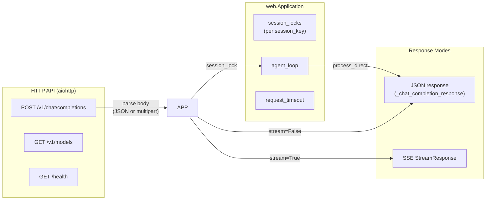
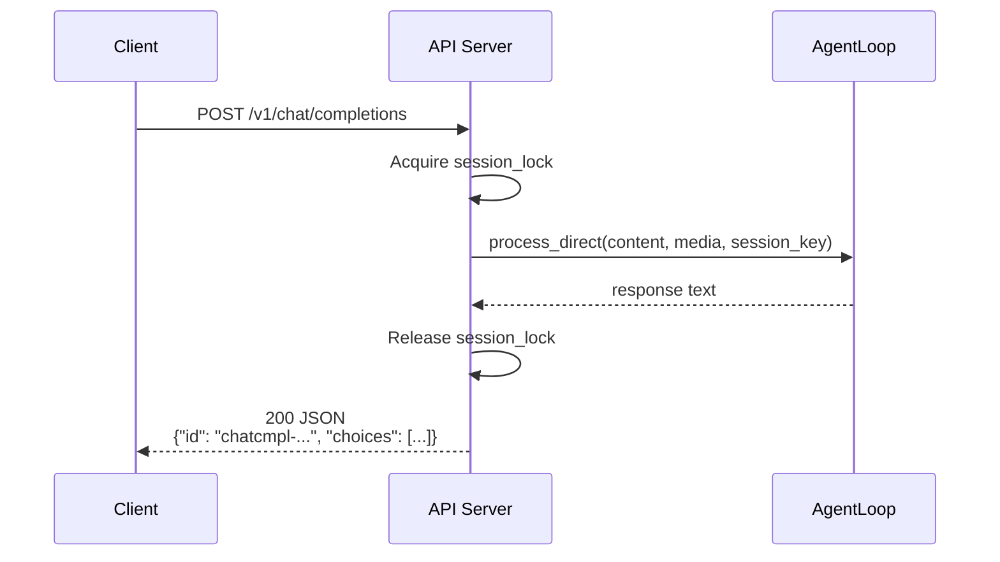
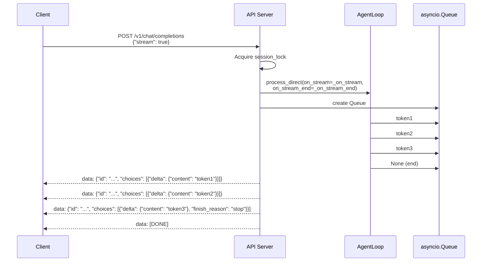

# API Server

The API server (`nanobot/api/server.py`) is an **OpenAI-compatible HTTP API** built on `aiohttp` (not FastAPI). It exposes endpoints for chat completions and model information. All requests route to a single persistent `AgentLoop` session.

## Endpoints

| Method | Path | Description |
|--------|------|-------------|
| `POST` | `/v1/chat/completions` | OpenAI-compatible chat completions |
| `GET` | `/v1/models` | List available models |
| `GET` | `/health` | Health check |

## Architecture



## /v1/chat/completions

Supports two input modes:

### JSON Body

```json
{
  "model": "nanobot",
  "messages": [{"role": "user", "content": "Hello!"}],
  "stream": false,
  "session_id": "optional-session-key"
}
```

`content` can be:
- A plain string
- A list of `{"type": "text", "text": "..."}` and `{"type": "image_url", "image_url": {"url": "data:..."}}` parts

Image URLs must be `data:` base64 URLs. Remote URLs are not supported.

### Multipart/Form-Data

```
POST /v1/chat/completions
Content-Type: multipart/form-data

message: "Analyze this"
session_id: my-session
model: nanobot
files: <binary file>
```

For file uploads, the field name must be `files`. Max file size: 10 MB.

## Streaming vs Non-Streaming

### Non-Streaming



If the response is empty, the request is retried once. If still empty, `EMPTY_FINAL_RESPONSE_MESSAGE` is returned.

Timeout: `request_timeout` (default 120s). On timeout → HTTP 504.

### Streaming (SSE)



SSE chunks use the OpenAI format:

```
data: {"id": "chatcmpl-xxx", "object": "chat.completion.chunk", "created": ..., "model": "nanobot", "choices": [{"index": 0, "delta": {"content": "..."}, "finish_reason": null}]}

data: [DONE]
```

**`stream_failed` flag**: If `_run()` raises an exception during streaming, `stream_failed = True` is set. The `finally` block cancels the task, but **no `stream_end` or `[DONE]` chunk is sent** — the client receives whatever was flushed before the error. The server does not close the connection prematurely to allow partial delivery.

```python
async def _run() -> None:
    nonlocal stream_failed
    try:
        async with session_lock:
            await asyncio.wait_for(
                agent_loop.process_direct(..., on_stream=_on_stream, on_stream_end=_on_stream_end),
                timeout=timeout_s,
            )
    except Exception:
        stream_failed = True
        logger.exception("Streaming error for session {}", session_key)
        await queue.put(None)
```

## WebSocket Endpoint

The API server is HTTP only. WebSocket support is in the **WebSocket channel** (`channels/websocket.py`) — see [websocket.md](../channels/doc/websocket.md). The HTTP API does not expose a WebSocket endpoint.

## Authentication

Authentication is configured at the **nanobot level** (not per-request in the API server). The `api_key` in the nanobot config is checked by a reverse proxy or middleware before requests reach the API server. The aiohttp app itself does not perform auth — it trusts the upstream gateway.

## CORS Configuration

CORS is handled by the reverse proxy (e.g., nginx) in front of the API server. The aiohttp app itself does not set CORS headers. If needed, middleware can be added:

```python
async def cors_middleware(app, handler):
    async def middleware(request):
        if request.method == "OPTIONS":
            response = web.Response()
            response.headers["Access-Control-Allow-Origin"] = "*"
            response.headers["Access-Control-Allow-Methods"] = "GET, POST, OPTIONS"
            response.headers["Access-Control-Allow-Headers"] = "Content-Type, Authorization"
            return response
        return await handler(request)
    return middleware
```

The server uses `aiohttp.web` (not FastAPI). Endpoints are registered directly on the `Application` router.

## Application Factory

```python
def create_app(
    agent_loop,
    model_name: str = "nanobot",
    request_timeout: float = 120.0,
) -> web.Application:
    app = web.Application(client_max_size=20 * 1024 * 1024)
    app["agent_loop"] = agent_loop
    app["model_name"] = model_name
    app["request_timeout"] = request_timeout
    app["session_locks"] = {}  # per-session_key asyncio.Lock

    app.router.add_post("/v1/chat/completions", handle_chat_completions)
    app.router.add_get("/v1/models", handle_models)
    app.router.add_get("/health", handle_health)
    return app
```

- `client_max_size`: 20 MB (for large base64 image uploads)
- `session_locks`: prevents concurrent requests to the same session from interleaving
- Per-request timeout: configurable, default 120 seconds
