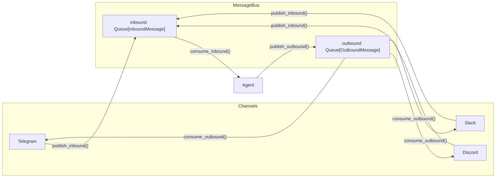
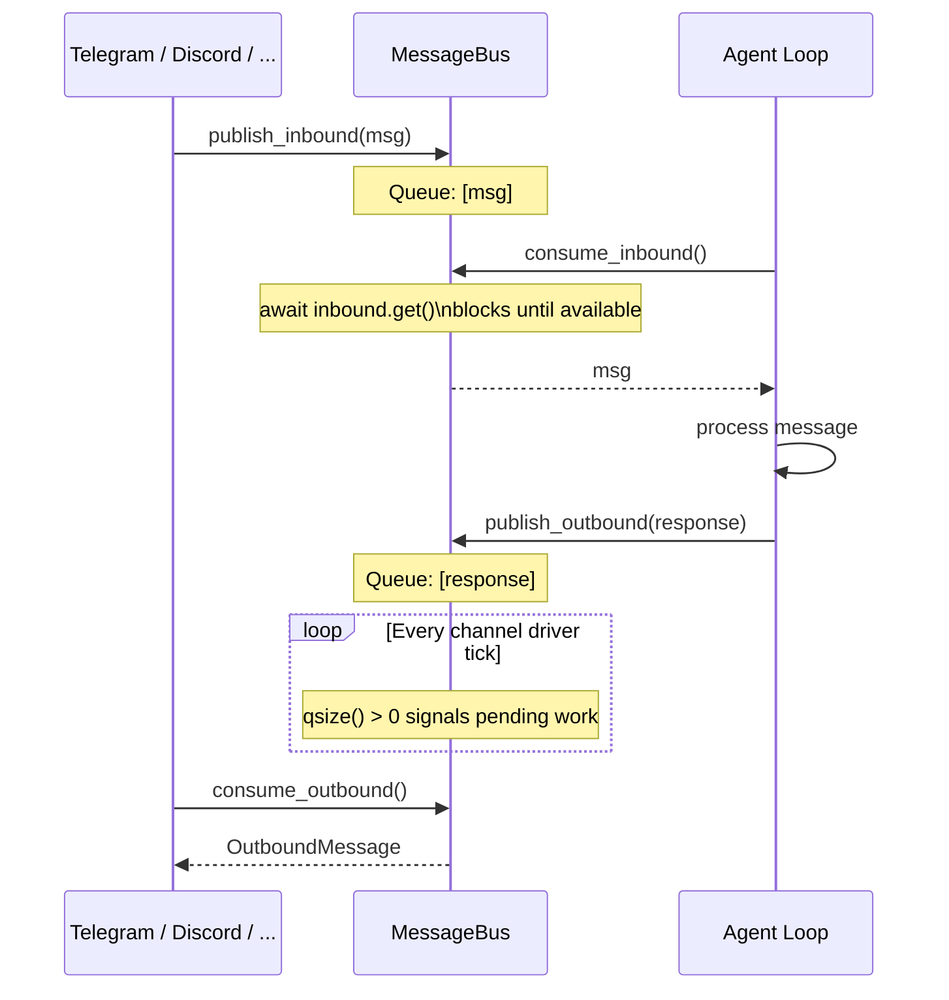
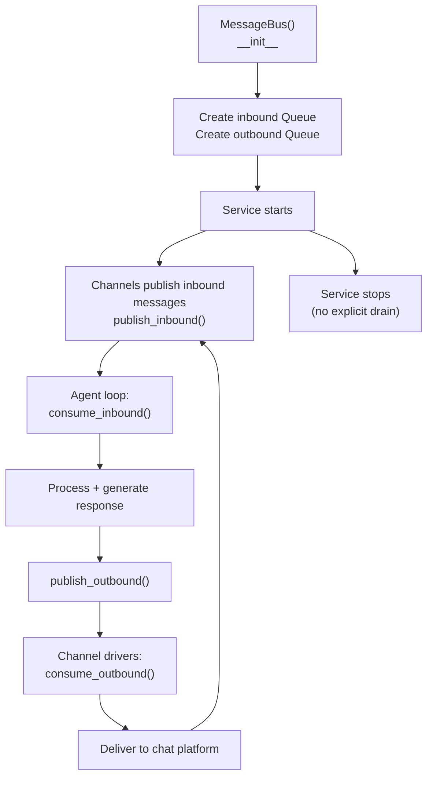

# MessageBus

**Source:** `nanobot/bus/queue.py`

An asyncio-based, in-process pub/sub message bus that decouples chat channel I/O from the agent core. Channels publish inbound messages and subscribe to outbound responses — all through async queues.

---

## Architecture



---

## Message Types

### InboundMessage

**Source:** `nanobot/bus/events.py`

```python
@dataclass
class InboundMessage:
    channel: str                        # "telegram", "discord", "slack", "whatsapp"
    sender_id: str                      # User identifier
    chat_id: str                        # Chat/channel identifier
    content: str                        # Message text
    timestamp: datetime                # Received time
    media: list[str] = field(default_factory=list)   # Media URLs
    metadata: dict[str, Any] = field(default_factory=dict)  # Channel-specific data
    session_key_override: str | None = None  # Override session routing

    @property
    def session_key(self) -> str:
        return self.session_key_override or f"{self.channel}:{self.chat_id}"
```

### OutboundMessage

**Source:** `nanobot/bus/events.py`

```python
@dataclass
class OutboundMessage:
    channel: str                        # Target channel
    chat_id: str                        # Target chat
    content: str                        # Message text
    reply_to: str | None = None         # Message ID to reply to
    media: list[str] = field(default_factory=list)
    metadata: dict[str, Any] = field(default_factory=dict)
```

---

## MessageBus Class

```python
class MessageBus:
    def __init__(self):
        self.inbound: asyncio.Queue[InboundMessage] = asyncio.Queue()
        self.outbound: asyncio.Queue[OutboundMessage] = asyncio.Queue()

    # Publishing
    async def publish_inbound(self, msg: InboundMessage) -> None
    async def publish_outbound(self, msg: OutboundMessage) -> None

    # Consuming
    async def consume_inbound(self) -> InboundMessage   # awaitable, blocks until message available
    async def consume_outbound(self) -> OutboundMessage  # awaitable, blocks until message available

    # Monitoring
    @property
    def inbound_size(self) -> int    # qsize()
    @property
    def outbound_size(self) -> int   # qsize()
```

---

## Subscriber Pattern

There is no explicit subscriber registration — the bus uses a **queue-based fan-out** pattern:



### Key Design Points

- **In-process only:** No network or inter-process transport. All queues live in the same Python process.
- **Blocking consume:** `consume_inbound()` and `consume_outbound()` use `await queue.get()`, which blocks until a message is available. This makes the agent loop simple: `msg = await bus.consume_inbound()`.
- **No acknowledgement:** After a channel driver calls `consume_outbound()`, the message is gone from the queue. If delivery fails, the channel driver is responsible for retry logic (tracked externally via `metadata`).
- **Single consumer per queue:** Each queue has exactly one consumer (the agent for inbound, the channel driver for outbound). If multiple consumers were needed, the queue would need to be multicast.
- **Backpressure:** If `inbound_size` grows large, the channel driver's `put()` caller will eventually block when the queue is full (default unbounded, so only memory is the limit).

---

## Lifecycle



---

## Integration with Session Routing

`InboundMessage.session_key` is derived automatically:

```python
@property
def session_key(self) -> str:
    return self.session_key_override or f"{self.channel}:{self.chat_id}"
```

This means each `(channel, chat_id)` pair maps to a separate session automatically — no configuration needed.
