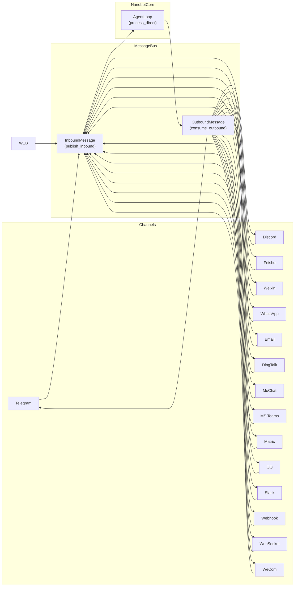
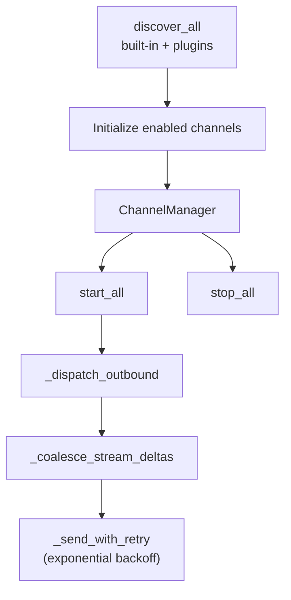

# Channels Module

Nanobot uses a **plugin-style channel architecture**. Each chat platform (Telegram, Discord, etc.) is implemented as a separate channel class that conforms to the `BaseChannel` interface. At runtime, `ChannelManager` discovers and initializes all enabled channels, starts them, and routes messages between the message bus and the appropriate platform.

## Architecture



All channels share the same pattern:

- **Inbound** — receive a platform message → wrap as `InboundMessage` → publish to `MessageBus`
- **Outbound** — receive `OutboundMessage` from `MessageBus` → deliver to the platform
- **Common interface** — `handle_inbound()` (via `_handle_message()`) and `handle_outbound()` (`send()` / `send_delta()`)

## BaseChannel

`BaseChannel` is the abstract base class for all channels (`nanobot/channels/base.py`).

```python
class BaseChannel(ABC):
    name: str = "base"
    display_name: str = "Base"

    def __init__(self, config: Any, bus: MessageBus):
        self.config = config
        self.bus = bus
        self._running = False

    async def start(self) -> None: ...
    async def stop(self) -> None: ...
    async def send(self, msg: OutboundMessage) -> None: ...
    async def send_delta(self, chat_id: str, delta: str, metadata: dict | None) -> None: ...

    @property
    def supports_streaming(self) -> bool: ...

    def is_allowed(self, sender_id: str) -> bool: ...
    async def _handle_message(self, sender_id, chat_id, content, ...) -> None: ...
```

Key methods:

| Method | Description |
|--------|-------------|
| `start()` | Connect to the platform and begin listening (abstract) |
| `stop()` | Disconnect and clean up (abstract) |
| `send(msg)` | Send a non-streaming `OutboundMessage` (abstract) |
| `send_delta(chat_id, delta, metadata)` | Deliver a streaming text chunk; default no-op |
| `_handle_message(...)` | Permission check + wraps inbound in `InboundMessage` and publishes to bus |
| `is_allowed(sender_id)` | Allow-list check against `allow_from` config |

## ChannelManager

`ChannelManager` (`nanobot/channels/manager.py`) is the runtime coordinator:



Responsibilities:
- Auto-discover channels via `discover_all()` (pkgutil scan + entry_points plugins)
- Initialize each enabled channel with shared transcription credentials
- Start/stop all channels and the outbound dispatcher
- Route outbound messages with retry (1s → 2s → 4s backoff)
- Coalesce consecutive `_stream_delta` messages to reduce per-chunk API calls

## Channel Registry

Channel discovery (`nanobot/channels/registry.py`) is zero-import — it scans the package directory at startup, so adding a new channel module automatically makes it available. External plugins can register via `entry_points(group="nanobot.channels")`.

## Supported Channels

| Channel | Module | Platform | Status |
|---------|--------|----------|--------|
| Telegram | `telegram.py` | Telegram Bot API | ✅ Built-in |
| Discord | `discord.py` | Discord Webhooks/Gateway | ✅ Built-in |
| Feishu | `feishu.py` | Lark / Feishu | ✅ Built-in |
| Weixin | `weixin.py` | WeChat (Weixin) | ✅ Built-in |
| WeCom | `wecom.py` | WeCom / Corporate WeChat | ✅ Built-in |
| WhatsApp | `whatsapp.py` | WhatsApp | ✅ Built-in |
| Email | `email.py` | IMAP/SMTP | ✅ Built-in |
| DingTalk | `dingtalk.py` | DingTalk | ✅ Built-in |
| MoChat | `mochat.py` | MoChat | ✅ Built-in |
| MS Teams | `msteams.py` | Microsoft Teams | ✅ Built-in |
| Matrix | `matrix.py` | Matrix Protocol | ✅ Built-in |
| QQ | `qq.py` | QQ | ✅ Built-in |
| Slack | `slack.py` | Slack | ✅ Built-in |
| Webhook | `webhook.py` | Generic HTTP POST | ✅ Built-in |
| WebSocket | `websocket.py` | WebSocket Server | ✅ Built-in |

## Common Interface

Every channel implements:

```python
# Inbound: received from platform → nanobot
await channel._handle_message(
    sender_id=...,   # platform user ID
    chat_id=...,      # platform chat/session ID
    content=...,     # text content
    media=[...],     # optional media URLs
    metadata={},    # channel-specific extra data
)
# internally publishes to: bus.publish_inbound(InboundMessage(...))

# Outbound: nanobot → platform
await channel.send(msg)          # non-streaming
await channel.send_delta(...)    # streaming chunk
```

## Streaming

Channels that support streaming override `send_delta()`:

```python
@property
def supports_streaming(self) -> bool:
    cfg = self.config
    streaming = cfg.get("streaming", False) if isinstance(cfg, dict) else getattr(cfg, "streaming", False)
    return bool(streaming) and type(self).send_delta is not BaseChannel.send_delta
```

When `supports_streaming` is `True`, the bus sets `_wants_stream: True` on inbound metadata, and the agent loop calls `on_stream(token)` / `on_stream_end()` callbacks. `ChannelManager` coalesces consecutive deltas for the same `(channel, chat_id)` to reduce API pressure.

## WebSocket Channel

See [websocket.md](./websocket.md) for the WebSocket server channel documentation.
