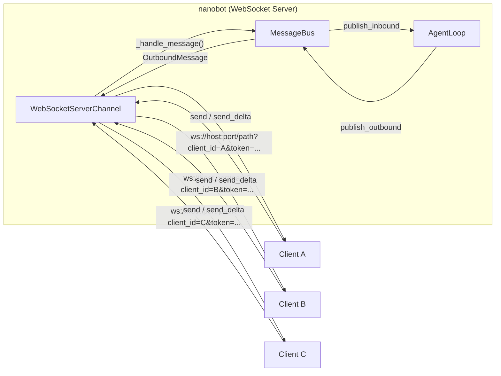
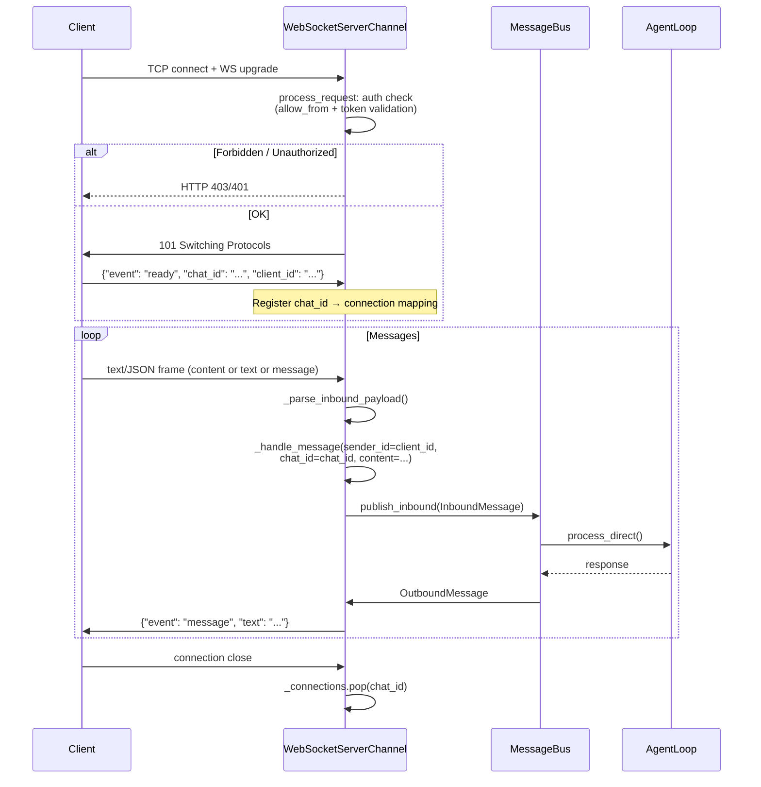
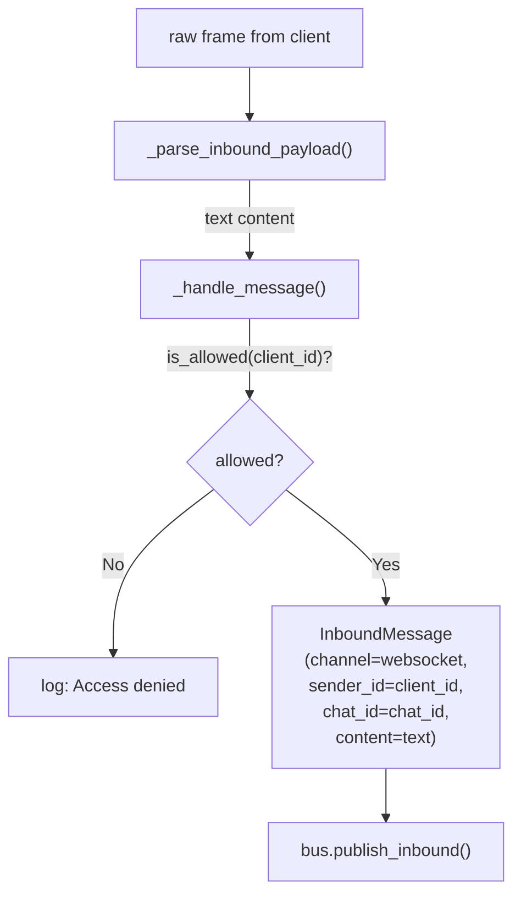
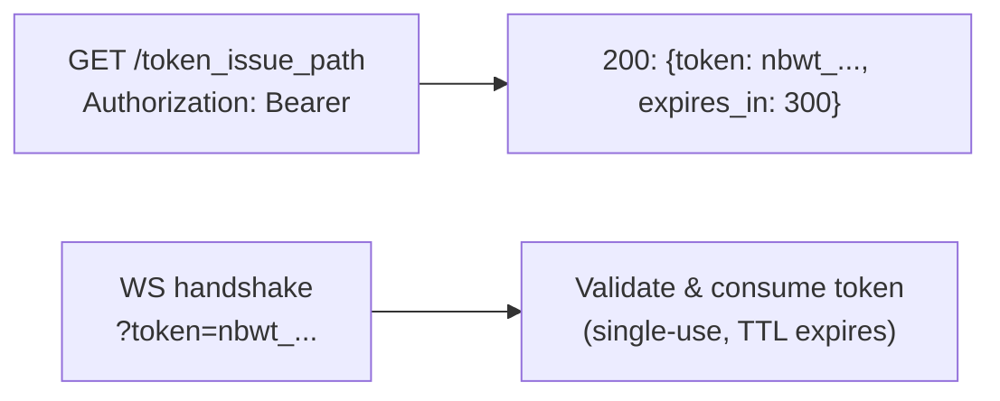

# WebSocket Channel

The WebSocket channel (`nanobot/channels/websocket.py`) runs a **WebSocket server embedded in nanobot**. Clients connect to nanobot over WebSocket, send text or JSON messages, and receive responses — nanobot acts as the server rather than a client.

## Overview



Each connected client is assigned a unique `chat_id` (UUID) on connection. The `client_id` query parameter is used for `allow_from` authorization.

## Connection Lifecycle



Steps:

1. **TCP connect + WS upgrade** — client initiates a WebSocket handshake
2. **Auth check** (`process_request`):
   - `allow_from` check against `client_id` query param
   - Token validation (static `token` or issued token)
   - HTTP token issue endpoint (`token_issue_path`) for short-lived tokens
3. **Ready** — server sends `{"event": "ready", "chat_id": "...", "client_id": "..."}`; only then is the connection registered
4. **Message loop** — client sends frames; `_parse_inbound_payload()` extracts text from plain strings or JSON `content`/`text`/`message` fields
5. **Disconnect** — `chat_id` is removed from `_connections`

## Message Format

### Inbound (Client → Nanobot)

Plain text string **or** JSON object:

```json
// Plain text
"hello"

 // JSON object — "content", "text", or "message" field
{
  "content": "hello"
}
```

Any other JSON structure is ignored; non-UTF-8 binary frames are dropped with a warning.

### Outbound (Nanobot → Client)

Standard message:

```json
{
  "event": "message",
  "text": "Hello! How can I help you?",
  "media": [],
  "reply_to": "msg_id"
}
```

Streaming delta:

```json
{
  "event": "delta",
  "text": "Hello",
  "stream_id": "abc123"
}
```

Stream end:

```json
{
  "event": "stream_end",
  "stream_id": "abc123"
}
```

## handle_inbound

`_handle_inbound()` → `_handle_message()` → `bus.publish_inbound(InboundMessage(...))`



## handle_outbound

`send()` delivers a full `OutboundMessage` as a `message` event:

```python
async def send(self, msg: OutboundMessage) -> None:
    connection = self._connections.get(msg.chat_id)
    payload = {
        "event": "message",
        "text": msg.content,
    }
    if msg.media:
        payload["media"] = msg.media
    if msg.reply_to:
        payload["reply_to"] = msg.reply_to
    await self._safe_send(msg.chat_id, json.dumps(payload))
```

`send_delta()` delivers a streaming chunk:

```python
async def send_delta(self, chat_id, delta, metadata=None) -> None:
    if metadata.get("_stream_end"):
        body = {"event": "stream_end"}
    else:
        body = {"event": "delta", "text": delta}
    if metadata.get("_stream_id"):
        body["stream_id"] = metadata["_stream_id"]
    await self._safe_send(chat_id, json.dumps(body))
```

## Configuration (WebSocketConfig)

```python
class WebSocketConfig(Base):
    enabled: bool = False
    host: str = "127.0.0.1"
    port: int = 8765
    path: str = "/"
    token: str = ""                        # static secret token
    token_issue_path: str = ""             # HTTP GET endpoint for short-lived tokens
    token_issue_secret: str = ""           # secret for token issue endpoint
    token_ttl_s: int = 300                 # issued token TTL (30–86400s)
    websocket_requires_token: bool = True  # require token on WS handshake
    allow_from: list[str] = ["*"]          # allowed client_id values
    streaming: bool = True
    max_message_bytes: int = 1_048_576     # 1 MB max frame
    ping_interval_s: float = 20.0
    ping_timeout_s: float = 20.0
    ssl_certfile: str = ""
    ssl_keyfile: str = ""
```

URL format: `ws://{host}:{port}{path}?client_id=...&token=...`

## Token Authentication

Two modes:

1. **Static token** — `token=...` query param must match the configured `token`
2. **Issued tokens** — client fetches a short-lived token via HTTP GET to `token_issue_path`, then presents it in the WS handshake



## SSL / WSS

Set both `ssl_certfile` and `ssl_keyfile` to enable WSS (TLS). If only one is set, startup raises an error.

```python
ssl_context = ssl.SSLContext(ssl.PROTOCOL_TLS_SERVER)
ssl_context.minimum_version = ssl.TLSVersion.TLSv1_2
ssl_context.load_cert_chain(certfile=cert, keyfile=key)
```
