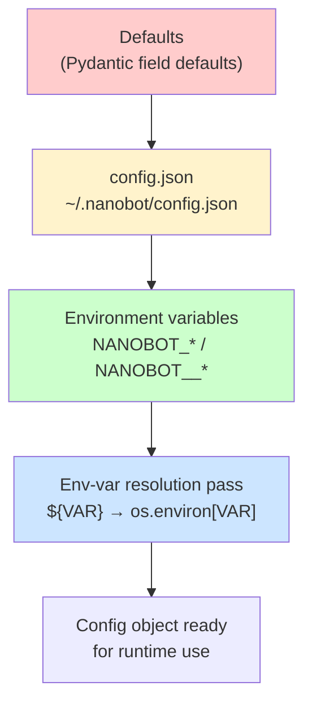
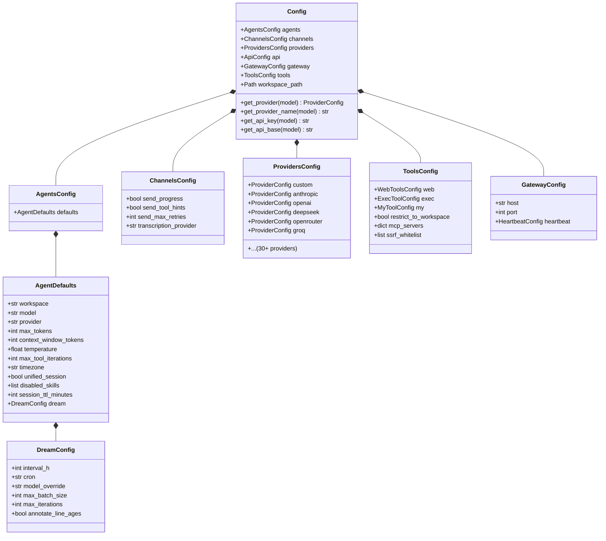
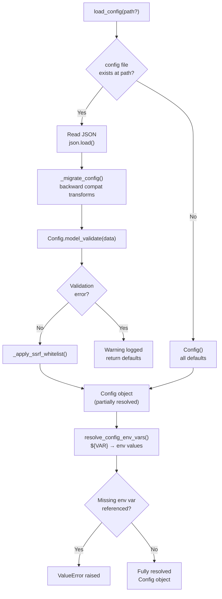
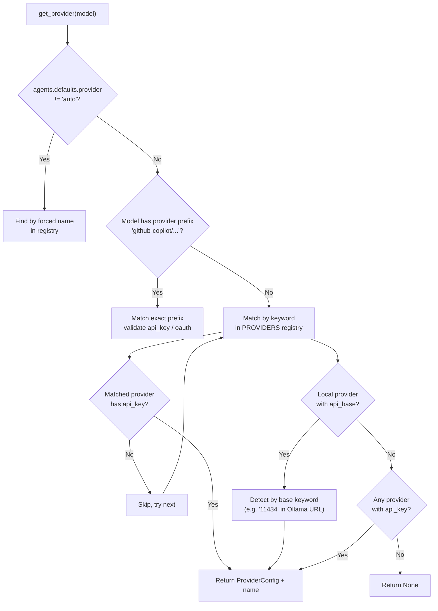

# Configuration System

**Sources:**
- `nanobot/config/schema.py` — Pydantic models
- `nanobot/config/loader.py` — Loading and env-var resolution utilities

---

## Config Hierarchy (Resolution Order)



**Precedence (highest wins):**
1. Environment variables (`NANOBOT_AGENTS__DEFAULTS__MODEL`, etc.)
2. `config.json` file values
3. Pydantic field defaults

After loading, `resolve_config_env_vars()` runs a second pass resolving `${VAR}` patterns inside string values (e.g., `api_key: "${TELEGRAM_BOT_TOKEN}"`).

---

## Config Schema

**Root model:** `Config` (extends `pydantic_settings.BaseSettings`)



---

## Key Config Sections

### `agents.defaults` — Agent Behaviour

| Field | Default | Description |
|-------|---------|-------------|
| `model` | `anthropic/claude-opus-4-5` | Default model |
| `provider` | `auto` | Provider name or `auto` |
| `max_tokens` | `8192` | Max response tokens |
| `context_window_tokens` | `65_536` | Context window size |
| `temperature` | `0.1` | Sampling temperature |
| `max_tool_iterations` | `200` | Tool call loop limit |
| `timezone` | `UTC` | IANA timezone for cron |
| `unified_session` | `false` | Share one session across all channels |
| `disabled_skills` | `[]` | Skill names to exclude |
| `session_ttl_minutes` | `0` | Idle compact threshold (0 = off) |
| `dream` | `DreamConfig` | Memory consolidation settings |

### `agents.defaults.dream` — Dream Memory Consolidation

| Field | Default | Description |
|-------|---------|-------------|
| `interval_h` | `2` | Run every N hours |
| `cron` | `None` | Override with cron expression |
| `model_override` | `None` | Use a different model for Dream |
| `max_batch_size` | `20` | Max history entries per run |
| `max_iterations` | `15` | Max tool calls per Phase 2 |
| `annotate_line_ages` | `True` | Add `← Nd` git-blame annotations |

### `channels` — Chat Channels

| Field | Default | Description |
|-------|---------|-------------|
| `send_progress` | `True` | Stream agent text output to channel |
| `send_tool_hints` | `False` | Stream tool-call hints |
| `send_max_retries` | `3` | Max delivery attempts |
| `transcription_provider` | `groq` | Voice transcription backend |

### `providers` — LLM Providers

Each provider has: `api_key`, `api_base`, `extra_headers`. Supported providers include: `anthropic`, `openai`, `deepseek`, `openrouter`, `groq`, `gemini`, `ollama`, `lm_studio`, `vllm`, `dashscope`, `zhipu`, `minimax`, `mistral`, and more.

### `tools` — Tool Configuration

| Sub-config | Key Fields |
|------------|------------|
| `web` | `enable`, `proxy`, `search.provider`, `search.api_key` |
| `exec` | `enable`, `timeout`, `path_append`, `sandbox`, `allowed_env_keys` |
| `my` | `enable`, `allow_set` (runtime state inspection) |
| `mcp_servers` | `type`, `command`, `args`, `env`, `url`, `headers`, `enabled_tools` |

### `gateway` — OpenClaw Gateway

| Field | Default | Description |
|-------|---------|-------------|
| `host` | `127.0.0.1` | Bind address |
| `port` | `18790` | Gateway port |
| `heartbeat.enabled` | `True` | Enable heartbeat |
| `heartbeat.interval_s` | `1800` | Heartbeat interval |

---

## Loading Flow



---

## Config Migration (`_migrate_config`)

Applied automatically on load to handle old config formats:

- `tools.exec.restrictToWorkspace` → `tools.restrictToWorkspace`
- `tools.myEnabled` → `tools.my.enable`
- `tools.mySet` → `tools.my.allowSet`

---

## Provider Auto-Detection



---

## Environment Variable Mapping

Pydantic uses `env_prefix = "NANOBOT__"` and `env_nested_delimiter = "__"`:

| Field Path | Env Variable |
|------------|--------------|
| `agents.defaults.model` | `NANOBOT__AGENTS__DEFAULTS__MODEL` |
| `tools.exec.timeout` | `NANOBOT__TOOLS__EXEC__TIMEOUT` |
| `providers.deepseek.api_key` | `NANOBOT__PROVIDERS__DEEPSEEK__API_KEY` |

Nested dict keys use `_` (Pydantic alias generator: `to_camel`):

```
NANOBOT__PROVIDERS__OPENAI__API_KEY=sk-...
```

---

## Config File Location

Default: `~/.nanobot/config.json`

Override via `load_config(Path("..."))` or `set_config_path(Path(...))`.
