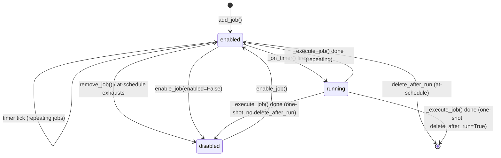
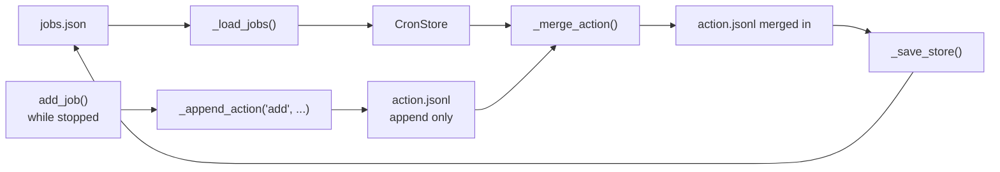

# CronService

**Source:** `nanobot/cron/service.py`

APScheduler-free job scheduler built on asyncio timers. The service manages time-based job execution for the agent with persistent storage and multi-instance safe action logging.

---

## Overview

`CronService` uses a self-contained timer mechanism rather than APScheduler. It maintains an in-memory store of `CronJob` instances and wakes periodically to check for due jobs. All mutations are written to disk via an append-only action log (`action.jsonl`) to support multi-instance deployments.

---

## Public API

### `add_job(name, schedule, message, deliver=False, channel=None, to=None, delete_after_run=False) -> CronJob`

Creates and persists a new cron job.

```python
job = cron_service.add_job(
    name="morning summary",
    schedule=CronSchedule(kind="cron", expr="0 9 * * *", tz="Asia/Singapore"),
    message="Give me a summary of my day",
    deliver=True,
    channel="telegram",
    to="12345678",
)
```

- Validates the schedule (e.g., `tz` only valid for `cron` kind, timezone must be parseable).
- Computes `next_run_at_ms` immediately via `_compute_next_run()`.
- If the service is **running**: loads store, appends job, saves, re-arms timer.
- If the service is **stopped**: appends an `"add"` action to `action.jsonl` for replay on startup.

---

### `remove_job(job_id) -> Literal["removed", "protected", "not_found"]`

Removes a job by ID. System jobs (`payload.kind == "system_event"`) are **protected** and cannot be removed.

```python
result = cron_service.remove_job("abc12345")
# "removed" | "protected" | "not_found"
```

---

### `get_job(job_id) -> CronJob | None`

Returns the job with the given ID, or `None` if not found.

---

### `list_jobs(include_disabled=False) -> list[CronJob]`

Lists all jobs sorted by `next_run_at_ms`. Pass `include_disabled=True` to also return paused jobs.

---

### `enable_job(job_id, enabled=True) -> CronJob | None`

Enable or disable a job. Disabling clears `next_run_at_ms`. Re-enabling recomputes it.

---

### `update_job(job_id, **kwargs) -> CronJob | "not_found" | "protected"`

Update mutable fields: `name`, `schedule`, `message`, `deliver`, `channel`, `to`, `delete_after_run`. System jobs cannot be updated.

---

### `run_job(job_id, force=False) -> bool`

Manually execute a job. If `force=False`, disabled jobs are skipped. Does not disturb the service's running state (temporarily sets `_running = True` for execution).

---

### `start() / stop()`

Start or stop the timer loop. `start()` loads the store, recomputes all next-run times, and arms the timer.

---

## Job State Machine



### State Fields

| Field | Type | Description |
|-------|------|-------------|
| `enabled` | `bool` | Job is active. `False` = paused. |
| `next_run_at_ms` | `int \| None` | When to fire next (ms epoch). `None` = no upcoming run. |
| `last_run_at_ms` | `int \| None` | Last execution timestamp. |
| `last_status` | `"ok" \| "error" \| "skipped" \| None` | Outcome of last run. |
| `last_error` | `str \| None` | Error message if last run failed. |
| `run_history` | `list[CronRunRecord]` | Last 20 execution records. |

### Schedule Kinds

| Kind | Fields | Behaviour |
|------|--------|-----------|
| `at` | `at_ms` | One-shot: fires once at the given timestamp. Becomes `enabled=False` after run (unless `delete_after_run=True`). |
| `every` | `every_ms` | Repeating: fires every `every_ms` milliseconds. |
| `cron` | `expr`, `tz?` | Repeating: fires per cron expression (e.g. `"0 9 * * *"`). `tz` sets the timezone. |

---

## Persistence

**Storage path:** `~/.openclaw/cron/jobs.json`

**Action log path:** `~/.openclaw/cron/action.jsonl` (append-only, for multi-instance coordination)



When the service starts (`start()`), it loads `jobs.json`, replays any pending actions from `action.jsonl` (which merges/creates/removes jobs accordingly), then clears `action.jsonl` and saves the merged result.

---

## Timer Mechanism

```mermaid
flowchart TD
    A["start() / _arm_timer()"] --> B["_get_next_wake_ms()\nmin of all enabled jobs' next_run_at_ms"]
    B --> C{next_wake exists?}
    C -->|Yes| D["delay = min(max_sleep_ms, next_wake - now)"]
    C -->|No| E["delay = max_sleep_ms\n5 minutes"]
    D --> F["asyncio.sleep(delay_s)"]
    E --> F
    F --> G["_on_timer()"]
    G --> H["Load store + merge actions"]
    H --> I{"Timer active\n(mid-execution)?}
    I -->|Yes, re-entrant guard| J["Return cached store"]
    I -->|No| K["Find due jobs\nnow >= next_run_at_ms"]
    K --> L["_execute_job() for each"]
    L --> M["Save store"]
    M --> N["_arm_timer() again"]
    J --> N
```

**Re-entrant guard:** `_timer_active` prevents `_load_store()` from replacing the in-flight store during job execution.

---

## System Jobs

`register_system_job(job: CronJob)` registers an internal job idempotently (replaces any existing job with the same ID). System jobs have `payload.kind == "system_event"` and are protected from removal/update. Used for Dream consolidation and other built-in recurring tasks.
