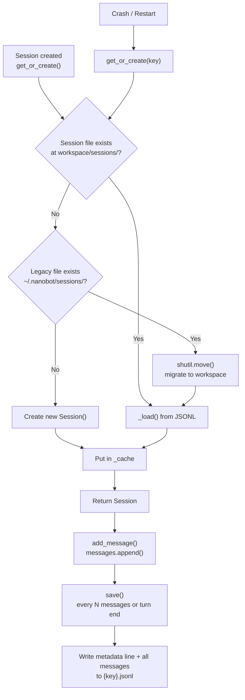
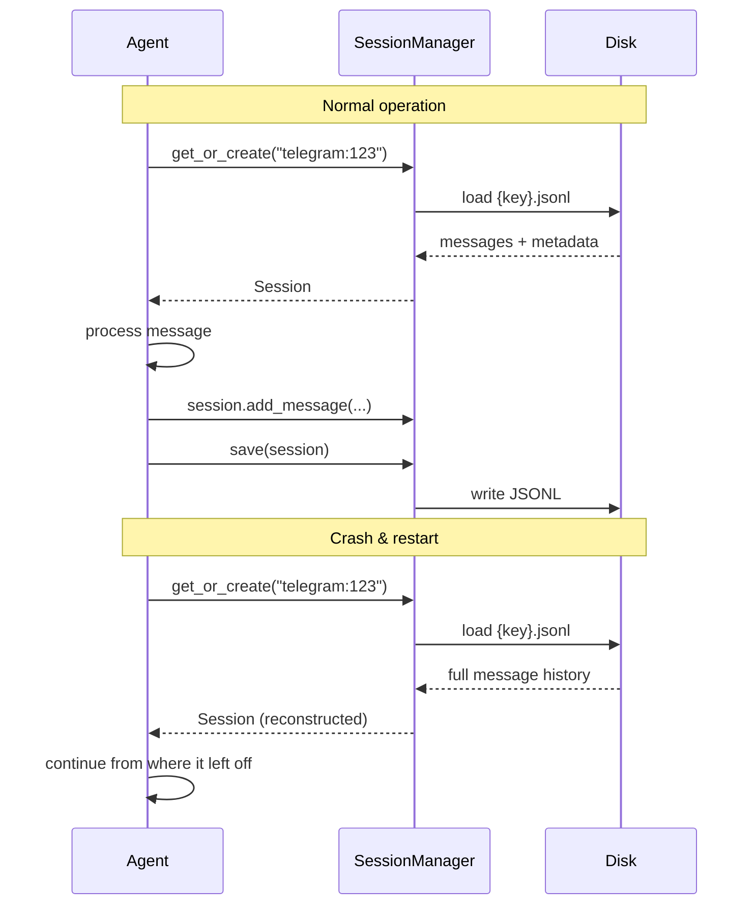

# SessionManager

**Source:** `nanobot/session/manager.py`

Manages conversation session persistence and history retrieval. Sessions are stored as JSONL files, one file per session key.

---

## Session

**Source:** `nanobot/session/manager.py` — `Session` dataclass

```python
@dataclass
class Session:
    key: str                           # channel:chat_id
    messages: list[dict[str, Any]]    # all messages
    created_at: datetime
    updated_at: datetime
    metadata: dict[str, Any]
    last_consolidated: int            # count of messages already flushed to disk
```

### Adding Messages

```python
session.add_message(role="user", content="Hello!")
session.add_message(role="assistant", content="Hi there!")
session.add_message(role="tool", content="...", tool_call_id="...", name="read")
```

**Supported roles:** `user`, `assistant`, `system`, `tool`

Each message is stamped with `"timestamp"` (ISO format) and any extra `kwargs`.

---

### Retrieving History

```python
history = session.get_history(max_messages=500) -> list[dict[str, Any]]
```

`get_history()` returns the **unconsolidated** message suffix (messages after `last_consolidated`), aligned to a legal tool-call boundary:

1. Takes the last `max_messages` unconsolidated messages.
2. If the first message is mid-turn (e.g., starts at an `assistant` or `tool` message), extends backward to the nearest `user` turn.
3. Uses `find_legal_message_start()` to drop orphan tool results at the front.
4. Returns clean `{role, content, optional: tool_calls/tool_call_id/name/reasoning_content}` entries.

This ensures the LLM always receives a coherent, self-contained conversation snippet.

---

### Trimming

```python
session.retain_recent_legal_suffix(max_messages=50)
```

Keeps only the last `N` messages, stopping at a user-turn boundary and dropping orphan tool results — mirroring `get_history()` boundary rules.

---

## SessionManager

**Source:** `nanobot/session/manager.py` — `SessionManager` class

### Session File Format

Sessions are stored as **JSONL** (JSON Lines) at:

```
~/.nanobot/sessions/{safe_key}.jsonl
```

Or migrated from legacy path:

```
~/.nanobot/sessions/{safe_key}.jsonl    ← legacy global location
```

Each line is either a metadata record (`_type: "metadata"`) or a message object:

```jsonl
{"_type": "metadata", "key": "telegram:123456", "created_at": "2026-04-18T10:00:00", "updated_at": "2026-04-18T10:30:00", "metadata": {}, "last_consolidated": 10}
{"role": "user", "content": "Hello", "timestamp": "2026-04-18T10:00:01"}
{"role": "assistant", "content": "Hi!", "timestamp": "2026-04-18T10:00:02"}
...
```

---

### `get_or_create(key) -> Session`

Returns the cached session if in memory, otherwise loads from disk, otherwise creates a new `Session`.

```python
session = manager.get_or_create("telegram:123456")
```

---

### `save(session) -> None`

Persists a session to disk as JSONL. Writes the metadata line first, then each message on its own line.

```python
manager.save(session)
```

The session is also kept in the in-memory `_cache` after saving.

---

### `invalidate(key) -> None`

Evicts a session from the in-memory cache. Used when a session needs to be fully reloaded from disk (e.g., after external modification).

---

### `list_sessions() -> list[dict]`

Lists all sessions by scanning `*.jsonl` files and reading only the metadata line. Returns `[{key, created_at, updated_at, path}, ...]` sorted by `updated_at` descending.

---

## Persistence & Crash Recovery



### Persistence Strategy

- Sessions are **not** saved after every message.
- The caller (agent loop) decides when to call `save()`, typically after each user-agent roundtrip.
- `last_consolidated` tracks how many messages have already been written to disk, so only new messages need to be flushed on save.
- After save, `last_consolidated` is **not** auto-incremented — the agent loop manages this counter to control what `get_history()` returns on the next turn.

### Crash Recovery

When the process restarts:

1. `get_or_create(key)` is called for the incoming session key.
2. If a JSONL file exists (or was migrated from the legacy path), all messages are loaded back.
3. `get_history()` is called with the reconstructed message list.
4. Boundary alignment (`find_legal_message_start()`) ensures the recovered history starts at a clean point, avoiding mid-turn tool-call fragments.



---

## Message Type Reference

| Role | Description | Common Fields |
|------|-------------|---------------|
| `user` | Human message | `content`, `timestamp` |
| `assistant` | AI response | `content`, `timestamp`, `tool_calls?`, `reasoning_content?` |
| `system` | System instruction | `content`, `timestamp` |
| `tool` | Tool call result | `content`, `timestamp`, `tool_call_id`, `name` |
